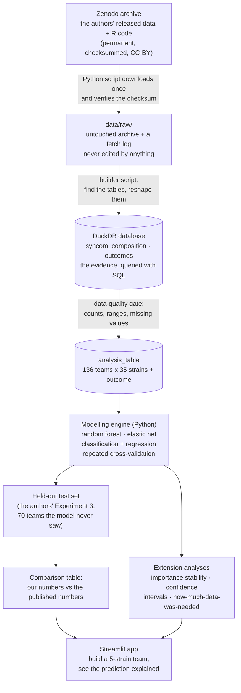

# RealSignal 🌱🔬

**v0.1.0** ·      

**Can a published machine-learning result in biology be rebuilt from
scratch, by one person, in a different programming language — and does
it still hold? RealSignal takes a real, open, peer-reviewed study of
plant-protecting bacteria and finds out, in public, fully explained.**

> Every term used anywhere in this repository — biological or
> technical — is defined in plain language in
> [`docs/GLOSSARY.md`](docs/GLOSSARY.md). If a word isn't there,
> that's a documentation bug. Please open an issue.

---

## Contents

- [What is a plant microbiome? (start here)](#what-is-a-plant-microbiome-start-here)
- [The problem this project tackles](#the-problem-this-project-tackles)
- [What "reproduction" means, and why it is the whole point](#what-reproduction-means-and-why-it-is-the-whole-point)
- [How it works](#how-it-works)
- [The data at a glance](#the-data-at-a-glance)
- [Build log](#build-log) — every phase, linked to its guide
- [**The tutorial, in order**](#the-tutorial-in-order) — the documents that teach every step from a blank laptop
- [About the data (honesty notes)](#about-the-data-honesty-notes)
- [Repository map](#repository-map) — every file, annotated
- [How to run](#how-to-run)
- [How this repository is developed (branches)](#how-this-repository-is-developed-branches)
- [Roadmap](#roadmap)
- [Why the documentation is so detailed](#why-the-documentation-is-so-detailed)
- [Credits and licence](#credits-and-licence)

---

## What is a plant microbiome? (start here)

*No biology background needed. If you can picture a garden, you can
follow this.*

Look closely at the leaf of any plant growing outdoors. It looks clean.
It isn't. Every square centimetre carries millions of bacteria — mostly
harmless, many helpful. That resident population is the plant's
**microbiome**: the community of microscopic organisms living on and in
it.

Think of it exactly like the bacteria on your own skin. You are covered
in them. Most do nothing bad. Some are actively useful, because by
occupying the space and eating the available food, they leave no room
for the nasty ones to move in.

Now the trouble. Some bacteria *are* nasty — they attack the plant,
multiply inside the leaf, and the plant sickens and dies. A bacterium
that causes disease is called a **pathogen**. In agriculture, pathogens
destroy a serious share of the world's food crops every year.

The conventional answer is to spray a chemical. The alternative that
scientists are now chasing is this: if some of the plant's *own*
harmless residents already keep pathogens out, could we identify those
particular residents, grow them, and deliberately apply them to crops —
using life to protect against life instead of chemistry? That approach
is called **biocontrol**, and the useful strains are called
**biocontrol strains**.

A **strain** is one specific, named, genetically distinct type of
bacterium, kept alive in a laboratory freezer — the microbial
equivalent of one specific breed of dog rather than "dog" in general.
In this project the strains have names like `Leaf15` and `Leaf68`,
because they were isolated from real leaves and numbered.

So the practical question is simply: **which strains actually protect
the plant?**

---

## The problem this project tackles

### The pain point

Answering "which strains protect the plant?" is much harder than it
sounds, and the reason is a genuinely interesting one.

Bacteria do not live alone. They live in communities, and they interact
— competing for food, chemically inhibiting one another, sometimes
helping one another. So a strain that looks protective when tested by
itself in a clean laboratory dish may do nothing at all once it is
sitting on a real leaf surrounded by thirty other species. And a strain
that looks useless alone may be a quiet hero in company.

**An everyday analogy.** Imagine you manage a 5-a-side football league
and you want to know which individual players actually win games. You
could test each player alone against a wall — but football is not
played against a wall. Player performance only means anything inside a
team. So instead you form many random 5-player teams, record each
team's result, and then work backwards: *which players keep showing up
in the teams that win?*

That is precisely the experimental design of the study RealSignal
rebuilds. Researchers at ETH Zurich took a pool of **35** harmless leaf
bacteria, assembled **136 random 5-strain teams**, put each team on its
own set of plants, infected all the plants with the same pathogen, and
then measured how much pathogen grew on each plant. Then they used
machine learning to work out which individual strains were driving the
good results — and finally went back to the lab and tested those
strains directly, to check that the computer was right.

It was. Three strains — *Pseudomonas* Leaf15, *Rhizobium* Leaf68 and
*Acidovorax* Leaf76 — turned out to genuinely reduce the pathogen, and
one of them had never been identified as protective before.

### Why it matters

That is a template for finding useful microbes without brute-force
testing every possibility, and brute force is the current bottleneck in
the field. It is also a beautiful, small, *complete* example of applied
machine learning in biology: a real question, a real experiment, real
messy measurements, a model, and — crucially — a laboratory check on
whether the model told the truth.

### The second pain point: does it reproduce?

Here is the uncomfortable part of modern science. A published result is
a *claim*. Independently rebuilding that claim from the released data —
by someone else, on another machine, in another programming language —
is what turns a claim into knowledge. Surveys across many fields have
repeatedly found that a large fraction of published computational
results are hard or impossible to rebuild, because code goes missing,
software versions drift, an undocumented manual step existed, or the
data released is not quite the data analysed.

Reproduction work is therefore genuinely valuable and genuinely rare —
and almost nobody does it in public, step by step, in a way a newcomer
can follow.

### What RealSignal is

An end-to-end, open, independent reproduction **and extension** of that
published analysis, built in Python from the authors' released data:

1. **Acquire** the real published dataset from its permanent public
   archive, verified by checksum so we can prove we have exactly the
   file the authors deposited.
2. **Rebuild** the analysis table — which strains were on which team,
   and how much pathogen each team's plants ended up with — and store
   it in a small local database that we question using SQL.
3. **Reproduce** the machine learning in Python (the original was
   written in R): predict protection from team composition, measure
   honestly on data the model never saw, and rank the strains by
   importance.
4. **Compare** our numbers to the published numbers, and say plainly
   where they match and where they don't.
5. **Extend** the analysis with checks the original paper did not
   report — how stable the strain ranking is, how much confidence the
   numbers deserve, and *how many teams you would actually have needed
   to screen* to reach the same answer. That last question is useful to
   anyone planning a similar experiment, because each team costs weeks
   of laboratory work.
6. **Serve** the result as a small interactive application where anyone
   can assemble a 5-strain team and see the predicted outcome, with a
   plain-language explanation.

Every step is documented so that a complete beginner can rebuild all of
it and understand *why* each step exists. The repository is the
tutorial.

---

## What "reproduction" means, and why it is the whole point

Three words get used loosely. This project uses them precisely, and you
should too:

| Word | Plain meaning | Everyday analogy |
|---|---|---|
| **Reproduction** | Same data, same question, rebuilt analysis. Do you get the same answer? | Re-cooking a dish from the published recipe using the same ingredients, in your own kitchen. |
| **Replication** | New data from a new experiment, same question. | Growing your own tomatoes and cooking the dish again. |
| **Extension** | Same data, new questions the original didn't ask. | Asking whether the dish still works with half the cooking time. |

RealSignal does **reproduction** and **extension**. It cannot do
replication, because replication would require a greenhouse, thirty-five
bacterial cultures and about six months. That limitation is stated
plainly here and in every document, because overstating what a project
proves is the fastest way to lose a reader's trust.

There is a further honest subtlety, and it is worth understanding
before you start. Our reproduction is **cross-language**: the authors
worked in R (with the `caret`, `randomForest` and `glmnet` packages);
we work in Python (with `scikit-learn`). The underlying mathematics is
the same, but the default settings, the random-number generators and
the small implementation choices are not identical. So we should expect
*close agreement in the conclusions* — which strains matter, roughly
how accurate the models are — and we should **not** expect
digit-for-digit identical numbers. A cross-language reproduction that
lands in the same place is arguably stronger evidence than a
same-language one, because it shows the finding does not depend on one
particular toolbox. Where our numbers differ, the project's job is to
explain why, not to quietly tune settings until they match. Tuning
until you match a known answer is a well-known way to fool yourself,
and it has a name: *hindsight fitting*.

---

## How it works



In words: download the authors' data exactly as they deposited it and
never edit that copy; build a tidy second copy in a small database;
train the models on the training teams only; judge them on teams they
have never seen; put our numbers next to the published numbers
honestly; then ask the extra questions the paper didn't; and finally
wrap the result in something a non-programmer can click.

Each of those boxes is one build phase and one tutorial document. The
full walkthrough — what every box is, why it exists, and what would go
wrong without it — is
[`docs/00-architecture.md`](docs/00-architecture.md).

---

## The data at a glance

Everything below comes from the published study and its open data
deposit. It is stated here so you know what you are getting *before*
you download anything.

| Fact | Value |
|---|---|
| Source study | Emmenegger, Massoni, Pestalozzi *et al.* (2023), *Nature Communications* **14**, 7983 |
| Open access article | <https://doi.org/10.1038/s41467-023-43793-z> |
| Data + original R code | Zenodo, <https://doi.org/10.5281/zenodo.10118600> (CC-BY 4.0) |
| Plant | *Arabidopsis thaliana* — thale cress, the laboratory rat of plant biology |
| Pathogen | *Pseudomonas syringae* pv. *tomato* DC3000 |
| Strain pool | 35 harmless leaf bacteria from the *At*-LSPHERE collection |
| Team size | 5 strains per team ("Mini5SynCom") |
| Training teams | 136 randomly assembled teams (Experiments 1 and 2) |
| Individual plants measured | 544 |
| Independent test teams | 70 (Experiment 3) — assembled and measured separately, none matching a training team |
| What was measured per plant | Pathogen abundance, commensal abundance, plant fresh weight |
| Units of the outcome | Colony-forming units per gram of plant tissue, spanning roughly four to nine orders of magnitude |
| Archive size | ~239 MB (one `.zip`; downloaded once, then cached) |

**The headline published results we will try to reproduce** — these are
the paper's numbers, not ours, and they are the target we are aiming at:

| Published result | Value reported in the paper |
|---|---|
| Classification accuracy on the independent test set | 84–93% (versus 51–56% for random guessing) |
| Recall for protective teams | 94–100% (versus 32% random) |
| Precision for protective teams | 72–82% (versus 35–42% random) |
| Regression error (RMSE) | 0.79–1.06 (versus 1.50 for predicting the average every time) |
| Most important strains | *Acidovorax* Leaf76, *Rhizobium* Leaf68, *Pseudomonas* Leaf15 |
| Next most important | *Rhizobium* Leaf371, then *Arthrobacter* Leaf337 |

**Our reproduction numbers will be filled into this README as each
phase completes**, side by side with the published ones, including the
places where they disagree. A reproduction that only reports its
successes is not a reproduction.

---

## Build log

Status of every phase. Documents marked ✅ are written and usable;
🚧 means the guide exists but the phase is not finished; ⏳ means
planned.

| # | Document | What it delivers | Status |
|---|---|---|---|
| — | [Glossary — every term in plain words](docs/GLOSSARY.md) | The vocabulary contract | ✅ living document |
| — | [Git workflow — how changes reach GitHub](docs/GIT_WORKFLOW.md) | The `develop → beta → master` habit | ✅ |
| 0 | [Architecture — how it all fits together](docs/00-architecture.md) | The map before the journey | ✅ |
| 1 | [Setup — from a blank laptop](docs/01-setup.md) | Working Python workshop on Windows, macOS or Linux | ✅ |
| 2 | [Phase 1 — Getting the real data](docs/02-phase-1-data-acquisition.md) | Verified download, inventory, raw snapshot | ✅ |
| 3 | Phase 2 — Building the analysis table | Teams × strains matrix in DuckDB, with quality gates | ⏳ |
| 4 | Phase 3 — Exploring the data | Distributions, the two-hump pattern, strain prevalence | ⏳ |
| 5 | Phase 4 — Reproducing the machine learning | Random forest + elastic net, honest evaluation | ⏳ |
| 6 | Phase 5 — Comparison and extension | Our numbers vs published; stability, intervals, data-efficiency | ⏳ |
| 7 | Phase 6 — The interactive application | Streamlit team designer with explanations | ⏳ |
| 8 | Phase 7 — Packaging and release | Tests, one-command pipeline, report, v1.0 | ⏳ |

---

## The tutorial, in order

Every step of this project — from an empty laptop to a working
application — is taught in `docs/`, written for someone with no
programming and no biology background, with every term defined in the
[glossary](docs/GLOSSARY.md) and every command shown together with the
output you should expect to see. Read in order:

| # | Guide | What it teaches |
|---|---|---|
| 00 | [Architecture](docs/00-architecture.md) | What every piece of the system is, why it exists, and how data moves between them |
| 01 | [Setup](docs/01-setup.md) | Blank laptop → working workshop: Python, Git, a virtual environment, the GitHub repository, and the habit of verifying every step |
| 02 | [Phase 1 — Data acquisition](docs/02-phase-1-data-acquisition.md) | Permanent archives, DOIs, checksums, downloading responsibly, and why the raw copy is sacred |
| — | [Git workflow](docs/GIT_WORKFLOW.md) | Branches explained from zero; the exact commands used at the end of every phase |
| — | [Glossary](docs/GLOSSARY.md) | Every term, biological and technical, in plain language |

---

## About the data (honesty notes)

These notes exist because the credibility of a reproduction rests
entirely on being straight about its limits.

- **The data is real, published, and not ours.** It was generated by
  Emmenegger, Massoni, Pestalozzi, Bortfeld-Miller, Maier and Vorholt
  at ETH Zurich and released under a Creative Commons Attribution
  licence (CC-BY 4.0). That licence permits reuse — including this one —
  on the condition that the creators are credited. They are credited in
  this README, in every document, in the application, and in the code
  that downloads their archive. **This project takes no credit for the
  data or for the original scientific finding.** Our contribution is
  the independent rebuild, the additional analyses, and the teaching
  material.
- **This is not a criticism of the original work.** The authors did the
  thing that makes reproduction possible at all: they released their
  data and their code, publicly and permanently, under an open licence.
  That is still not universal. Reproducing a study is a form of
  engagement with it, not an accusation against it.
- **Cross-language differences are expected.** See
  [What "reproduction" means](#what-reproduction-means-and-why-it-is-the-whole-point).
  Numbers close to the published ones support the finding; numbers
  identical to them would actually be slightly suspicious.
- **The biology is a controlled laboratory system**, not a field. The
  plants were grown sterile, in boxes, with exactly five known bacteria
  applied deliberately. That is a deliberate scientific simplification —
  it is what allows cause and effect to be established at all — but it
  means "Leaf76 protects *Arabidopsis* in a box" does not automatically
  mean "Leaf76 will protect wheat in a field in July".
- **A model trained here predicts this system only.** Any prediction
  the application makes is a prediction about the 35 strains, this
  pathogen, this plant, and this assay. It is not agricultural advice.
- **The measurements are noisy on purpose.** Living plants vary. Some
  bacterial counts in the original data could not be attributed to a
  single strain and are recorded as ambiguous; some plants were
  discarded for contamination. Those decisions are part of the data,
  they are documented by the original authors, and Phase 2 handles them
  explicitly rather than quietly dropping rows.
- **Nothing here is a claim about any commercial product.**

---

## Repository map

The full tree, annotated with the phase that creates each piece.
Items marked *(planned)* do not exist yet.

```
realsignal/
├── README.md                     ← you are here
├── LICENSE                       ← MIT (covers this project's code and docs,
│                                   not the authors' data — see Credits)
├── requirements.txt              ← the exact Python packages, pinned
├── setup.sh                      ← one-command setup for macOS / Linux
├── setup.ps1                     ← one-command setup for Windows PowerShell
├── .gitignore                    ← what must never be committed (data, .venv, secrets)
│
├── docs/                         ← the tutorial — the main deliverable
│   ├── 00-architecture.md        ← how it all fits together
│   ├── 01-setup.md               ← blank laptop → working workshop
│   ├── 02-phase-1-data-acquisition.md  ← the real data lands, verified
│   ├── GIT_WORKFLOW.md           ← branches, and the end-of-phase ritual
│   ├── GLOSSARY.md               ← every term, plain language, by phase
│   └── img/                      ← teaching figures (planned)
│
├── scripts/                      ← small standalone tools you run by hand
│   ├── check_env.py              ← proves your environment is correctly built
│   └── fetch_data.py             ← downloads + verifies + inventories the archive
│
├── src/realsignal/               ← the reusable, importable, tested engine
│   └── __init__.py               ← (grows from Phase 2 onward)
│
├── notebooks/                    ← line-by-line exploration (planned, Phase 3)
├── tests/                        ← automated checks (planned, Phase 4)
├── app/                          ← the Streamlit application (planned, Phase 6)
├── figures/                      ← charts produced from the real data (planned)
└── data/                         ← NOT in Git — regenerated by scripts/fetch_data.py
    ├── raw/                      ← the downloaded archive, never edited
    └── processed/realsignal.duckdb  ← the analysis database
```

**Why `data/` is not in Git.** Two reasons, both important. First,
practical: version control is designed for text you edit, not for a
239 MB binary archive, and committing it would make every future clone
of this repository slow and enormous. Second, and better: if the data
can be regenerated from a script, then *the script working is the
proof the project works*. Anyone cloning this repository runs one
command and ends up with byte-identical data, verified by checksum.
That is a stronger guarantee than a committed copy, which nobody can
check against anything.

---

## How to run

**Quick start**, once Python 3.11+ and Git are installed:

```bash
git clone https://github.com/akannan2987/realsignal.git
cd realsignal

# macOS / Linux
./setup.sh
source .venv/bin/activate

# Windows PowerShell
# .\setup.ps1
# .\.venv\Scripts\Activate.ps1

python scripts/check_env.py            # proves the workshop is built correctly
python scripts/fetch_data.py --probe   # see what will be downloaded, without downloading
python scripts/fetch_data.py           # download once (~239 MB), verified by checksum
```

If any of that looked like a foreign language, that is expected and
fine — **start instead at [`docs/01-setup.md`](docs/01-setup.md)**,
which assumes a completely blank machine and explains every word,
every command and every piece of output, for Windows, macOS and Linux
alike.

---

## How this repository is developed (branches)

This project uses three long-lived branches, and all work happens on
`develop`:

- **`develop`** — where changes are made. Always work here.
- **`beta`** — a checkpoint copy; what a tester would try.
- **`master`** — the published, presentable state.

The end of every build phase uses exactly the same short ritual:

```bash
git switch develop
git add -A
git commit -m "Phase N: what changed"
git push origin develop develop:beta develop:master

git switch master
git pull --ff-only origin master
git switch develop
```

Why three branches when you are one person? Because the habit is the
point: it separates *work in progress* from *what other people see*, it
is what teams actually do, and it costs one extra line. Every command
above is explained word by word — including what a branch *is*, with
analogies — in [`docs/GIT_WORKFLOW.md`](docs/GIT_WORKFLOW.md).

---

## Roadmap

Deferred with reasons, not promises:

- **Reproduce the linear mixed models too.** The paper also modelled
  the relationship between pathogen load and community evenness,
  colonisation and phylogenetic diversity. Waits on: mixed-effects
  modelling in Python is genuinely less mature than in R, and doing it
  badly would be worse than not doing it.
- **A knowledge graph of strain relationships.** Strains, their
  taxonomy, their measured protection, their co-occurrence in teams.
  Waits on: the core reproduction being finished first — a graph over
  unverified results would be decoration.
- **An MCP server** exposing the trained model so an AI assistant can
  query it directly. Waits on: a stable, tested model interface, which
  arrives in Phase 7.
- **Containerised run** (a `Dockerfile`) for one-command reproduction
  on any machine. Waits on: the plain virtual-environment path being
  proven on all three operating systems first, because that is the path
  most people will actually use.

---

## Why the documentation is so detailed

Documentation quality is a deliberate deliverable here, not an
afterthought.

This project's entire subject is reproducibility — whether a result
can be rebuilt by somebody who wasn't there. It would be absurd to
investigate that question and then publish something nobody else could
rebuild. So the standard this repository holds itself to is the same
one it applies to the study it examines: **a stranger with a blank
laptop, no programming background and no biology background must be
able to clone this, follow the documents in order, and end up with the
same working system and an understanding of why each piece exists.**

Every command is shown with the output you should expect. Every term is
in the glossary. Every file in the tree is explained somewhere. Where
something went wrong during the build, it is written down and kept
rather than tidied away, because the mistakes are usually the most
instructive part.

---

## Credits and licence

**The data and the original scientific work** are by Barbara
Emmenegger, Julien Massoni, Christine M. Pestalozzi, Miriam
Bortfeld-Miller, Benjamin A. Maier and Julia A. Vorholt (Institute of
Microbiology, ETH Zurich):

> Emmenegger, B., Massoni, J., Pestalozzi, C. M., Bortfeld-Miller, M.,
> Maier, B. A., & Vorholt, J. A. (2023). Identifying microbiota
> community patterns important for plant protection using synthetic
> communities and machine learning. *Nature Communications*, 14, 7983.
> <https://doi.org/10.1038/s41467-023-43793-z>
>
> Data and code repository: <https://doi.org/10.5281/zenodo.10118600>
> (CC-BY 4.0)

**This repository's code and documentation** are released under the MIT
licence. The authors' data retains its own CC-BY 4.0 licence and is not
redistributed here — it is downloaded directly from Zenodo by
`scripts/fetch_data.py`, so every user gets it from the original source
with its original terms attached.
