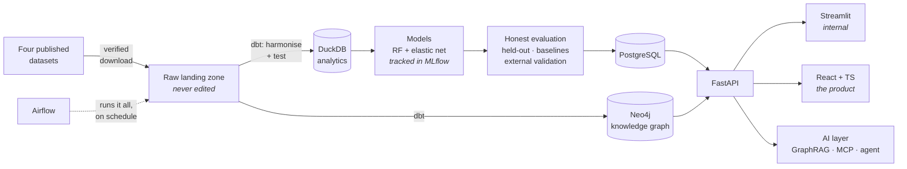

# RealSignal 🌱🔬

**v0.1.0** ·            

**Can a published machine-learning result in biology be rebuilt from
scratch, in a different language, by one person — and does it survive
being checked against evidence it never saw? RealSignal finds out, in
public, fully explained, from four linked open datasets.**

> Every term used anywhere in this repository — biological or
> technical — is defined in plain language in
> [`docs/GLOSSARY.md`](docs/GLOSSARY.md). If a word isn't there, that's
> a documentation bug. Please open an issue.

---

## Contents

- [What is a plant microbiome? (start here)](#what-is-a-plant-microbiome-start-here)
- [The problem this project tackles](#the-problem-this-project-tackles)
- [What "reproduction" means, and why it is the whole point](#what-reproduction-means-and-why-it-is-the-whole-point)
- [How it works](#how-it-works)
- [The four data layers](#the-four-data-layers)
- [The product](#the-product)
- [Build status](#build-status) — what exists today, and what is planned
- [**The tutorial, in order**](#the-tutorial-in-order)
- [About the data (honesty notes)](#about-the-data-honesty-notes)
- [Repository map](#repository-map)
- [How to run](#how-to-run)
- [How this repository is developed (branches)](#how-this-repository-is-developed-branches)
- [Why the documentation is so detailed](#why-the-documentation-is-so-detailed)
- [Credits and licence](#credits-and-licence)

---

## What is a plant microbiome? (start here)

*No biology background needed. If you can picture a garden, you can
follow this.*

Look closely at the leaf of any plant growing outdoors. It looks clean.
It isn't. Every square centimetre carries millions of bacteria — mostly
harmless, many helpful. That resident population is the plant's
**microbiome**.

Think of the bacteria on your own skin. You are covered in them. Most
do nothing bad, and some are actively useful, because by occupying the
space and eating the available food they leave no room for the nasty
ones to move in.

Now the trouble. Some bacteria *are* nasty — they attack the plant,
multiply inside the leaf, and it sickens and dies. A bacterium that
causes disease is called a **pathogen**, and pathogens destroy a serious
share of the world's food crops every year.

The conventional answer is a chemical spray. The alternative scientists
are now chasing: if some of the plant's *own* harmless residents
already keep pathogens out, could we identify those particular
residents, grow them, and deliberately apply them to crops — using life
to protect against life? That is **biocontrol**.

A **strain** is one specific, named, genetically distinct type of
bacterium kept alive in a laboratory freezer — the microbial equivalent
of one particular breed rather than "dog" in general. Ours have names
like `Leaf15` and `Leaf68`, because they were isolated from real leaves
and numbered.

So the practical question is: **which strains actually protect the
plant?**

---

## The problem this project tackles

### The pain point

Answering that is far harder than it sounds, for an interesting reason.

Bacteria do not live alone. They compete for food, chemically inhibit
one another, sometimes help one another. A strain that looks protective
by itself in a clean laboratory dish may do nothing on a real leaf
surrounded by thirty other species. A strain that looks useless alone
may be a quiet hero in company.

**An everyday analogy.** You manage a 5-a-side football league and want
to know which individual players actually win games. Testing a player
alone against a wall tells you nothing, because football is not played
against a wall. So instead: form many random 5-player teams, record
every result, then work backwards — *which players keep appearing in
the teams that win?*

That is exactly the design of the study RealSignal rebuilds.
Researchers at ETH Zurich took **35** harmless leaf bacteria, assembled
**136 random 5-strain communities**, applied each to its own set of
plants, infected all of them with the same pathogen, measured how much
pathogen grew — then used machine learning to work out which
individual strains drove the good outcomes, and went back to the
laboratory to check.

It held up. Three strains — *Pseudomonas* Leaf15, *Rhizobium* Leaf68
and *Acidovorax* Leaf76 — genuinely reduced the pathogen, and one had
never been identified as protective before.

### Why it matters

That is a template for finding useful microbes without brute-force
testing every possibility — and brute force is the field's current
bottleneck. A pool of 35 strains yields over 300,000 possible 5-strain
communities. A laboratory can test perhaps a hundred a year.

### The second pain point: does it reproduce?

A published result is a *claim*. Independently rebuilding it from the
released data — by someone else, on another machine, in another
language — is what turns a claim into knowledge. Surveys across many
fields keep finding that a large share of published computational
results are hard or impossible to rebuild: code goes missing, software
versions drift, an undocumented manual step existed.

Reproduction work is genuinely valuable and genuinely rare — and almost
nobody does it in public, step by step, in a way a newcomer can follow.

### What RealSignal is

An end-to-end, open, independent reproduction **and extension**, built
in Python from four linked published datasets:

1. **Acquire** all four sources from their permanent public archives,
   each verified by checksum.
2. **Harmonise** them onto one strain key with a tested, documented
   transformation pipeline — four laboratories, years apart, spell the
   same strain differently.
3. **Reproduce** the published machine learning in Python (the original
   was written in R), evaluated honestly on communities the model never
   saw.
4. **Compare** our numbers to the published numbers, plainly, including
   where they disagree — then go further and **run the authors' own R
   code**, which ships with their data. That gives a three-way
   comparison (paper → their code → our rebuild) which can distinguish
   a mistake in our rebuild from a gap in the original, where a
   two-way comparison can only shrug.
5. **Integrate** the genomic and network layers: do the strains the
   model ranks highly carry more antibiotic-producing gene clusters?
   That turns a statistical result into a mechanism.
6. **Validate externally** against a separate study that measured every
   strain *alone* — evidence our model never touched.
7. **Serve** it as a real product: an API, an interface, a knowledge
   graph, and an AI layer that can answer *why*.

Every step is documented so a complete beginner can rebuild all of it
and understand why each piece exists. **The repository is the
tutorial.**

---

## What "reproduction" means, and why it is the whole point

Three words get used loosely. This project uses them precisely:

| Word | Plain meaning | Everyday analogy |
|---|---|---|
| **Reproduction** | Same data, same question, rebuilt analysis | Re-cooking a dish from the published recipe, in your own kitchen |
| **Replication** | New data from a new experiment, same question | Growing your own tomatoes and cooking it again |
| **Extension** | Same data, new questions the original didn't ask | Asking whether it still works with half the cooking time |

RealSignal does **reproduction** and **extension**. It cannot do
replication — that needs a greenhouse, thirty-five bacterial cultures
and six months. Stated plainly here and in every document, because
overstating what a project proves is the fastest way to lose a reader's
trust.

One honest subtlety worth understanding before you start. Our
reproduction is **cross-language**: the authors worked in R (`caret`,
`randomForest`, `glmnet`); we work in Python (`scikit-learn`). The
mathematics is the same; the defaults, random-number generators and
small implementation choices are not. So expect *close agreement in the
conclusions* and **not** digit-for-digit identical numbers. A
cross-language reproduction landing in the same place is arguably
stronger evidence than a same-language one, because it shows the
finding does not depend on one toolbox.

Where our numbers differ, the job is to explain why — not to quietly
tune settings until they match. Tuning until you agree with an answer
you already know is a well-known way to fool yourself, and it has a
name: *hindsight fitting*.

---

## How it works



Take four published datasets about the same bacteria; keep untouched
copies; harmonise them onto one key with a tested pipeline; store the
result as tables *and* as a graph; train on the training communities
only; judge against communities never seen and against an independent
study; serve it through an API to a prototype, a product and an AI
layer; and have an orchestrator run the whole thing.

The full walkthrough — what every box is, why it exists, and what would
break without it — is in
[`docs/00-architecture.md`](docs/00-architecture.md).

---

## The four data layers

RealSignal is **multi-source**, and that is the point: one dataset
answers one question, four linked datasets answer questions none of
them could alone. All four describe the **same strain collection** —
the *At*-LSPHERE, isolated from wild *Arabidopsis* leaves — which is
what makes joining them possible.

| # | Layer | What it contributes | Source | Status |
|---|---|---|---|---|
| 1 | Community composition + pathogen outcome | 136 training + 70 independent test communities | Emmenegger *et al.* 2023, *Nat Commun* 14:7983 · [Zenodo](https://doi.org/10.5281/zenodo.10118600) · CC-BY 4.0 | ✅ downloaded, checksum verified |
| 2 | Strain genomes | The genetic blueprint of each strain | Bai *et al.* 2015, *Nature* 528:364 · [at-sphere.com](https://www.at-sphere.com/) | ⏳ access to be confirmed |
| 3 | Biosynthetic gene clusters + strain–strain inhibition network | >1,000 predicted natural-product clusters; ~50,000 pairwise interactions | Helfrich *et al.* 2018, *Nat Microbiol* · [doi:10.1038/s41564-018-0200-0](https://doi.org/10.1038/s41564-018-0200-0) | ⏳ access to be confirmed |
| 4 | Single-strain protection scores | 224 strains each tested **alone** | Vogel *et al.* 2021, *Nat Microbiol* · [doi:10.1038/s41564-021-00997-7](https://doi.org/10.1038/s41564-021-00997-7) | ⏳ access to be confirmed |

**Why each earns its place.** Layer 1 asks *which communities protect?*
Layers 2–3 ask *why* — genes encode the chemistry a strain can make, so
if the highly-ranked strains carry more antibiotic gene clusters, the
statistical result gains a mechanism. Layer 3's network asks *how do
they interact?* And Layer 4 is the prize: our model learns which
strains matter **from communities only**, never seeing a strain tested
alone — so comparing its ranking against Layer 4 tests the conclusion
against evidence it never touched. That is a stronger claim than
reproducing the original numbers.

> **Honesty note.** Only Layer 1 is confirmed and downloaded. Layers
> 2–4 come from papers whose supplementary data may or may not be
> freely accessible; that has not yet been checked. **Phase 2 begins by
> verifying access and recording the result — including any layer that
> proves unobtainable.** A source that cannot be obtained is a finding
> to report, not a gap to paper over. Layer 1 alone supports a complete
> reproduction; every further layer is an enhancement, not a
> dependency.

---

## The product

A system is not a product until you can name the user and the decision.

- **User:** a scientist choosing which strain combinations to test next.
- **Problem:** each combination costs weeks of glasshouse work, and
  there are over 300,000 possibilities.
- **Decision supported:** *which handful should I test next?*
- **Value:** ranking candidates before committing laboratory time turns
  an intractable search into a shortlist.
- **Success metric:** hit rate of recommended communities versus
  randomly chosen ones, measured on held-out data. A real number, not a
  claim.

**What it deliberately does not claim.** The plants were grown sterile,
in sealed boxes, with exactly five known bacteria — a scientific
simplification that is precisely what allows cause and effect to be
established. But "Leaf76 protects *Arabidopsis* in a box" does not mean
"Leaf76 will protect wheat in a field in July". The application says so
on screen. A product that overstates its scope is worse than no
product, because it will be believed.

### The part that generalises

The trained model is specific to these 35 strains, this pathogen and
this plant. **The method is not.**

Underneath the biology sits a problem that has nothing to do with
bacteria: *you have N components, you can combine k of them, N-choose-k
is astronomically larger than what you can afford to test, and each
test is slow and expensive. Which handful do you test next?*

Thirty-five strains taken five at a time gives over 300,000
combinations. Testing a hundred a year, exhaustive search takes three
thousand years. **No amount of laboratory funding solves that; only a
better choice of which experiments to run does.**

The same shape of problem appears wherever combinations of living
components are designed — protective consortia in agriculture, defined
multi-strain formulations in health, starter blends in fermentation,
production consortia in industrial biotechnology. The organisms differ;
the arithmetic does not.

So this project is built to make the *method* portable, not just the
result:

- **Nothing assumes 35 strains, five members, one pathogen or one
  readout.** The data model treats the strain library, the community
  size and the measured outcome as inputs, not constants. Hard-coding
  them would be marginally simpler now and would make the whole thing
  single-use.
- **The interesting loop is not a single prediction.** It is *predict →
  test a shortlist → feed the results back → retrain → predict better*.
  A tool that only answers once is a calculator; one that improves with
  every round of experiments is worth returning to.
- **It runs entirely on your own machine.** Containerised, no external
  service, nothing uploaded anywhere. That is a design choice made for
  reproducibility, and it happens to be the only arrangement acceptable
  to anyone whose strain library is confidential.

---

## Build status

**Phase 1 of 18 complete.** The full plan, with effort estimates and
the reasoning behind every tool chosen *and* rejected, is in
[`docs/ROADMAP.md`](docs/ROADMAP.md).

Phases alternate between the science track and the platform track, so
that there is always something working to show and the two keep
correcting each other.

| # | Phase | Track | Status |
|---|---|---|---|
| 1 | Data acquisition — verified, logged, idempotent | Science | ✅ **done** |
| 2 | Multi-source ingestion (Layers 2–4) | Science | ⏳ |
| 3 | Harmonisation with dbt — one key, tested, documented | Science | ⏳ |
| 4 | Exploration — distributions, quality, first figures | Science | ⏳ |
| 5 | Reproduction of the published models + MLflow | Science | ⏳ |
| 6 | **The original R analysis** — run the authors' own code; the three-way comparison | Science | ⏳ |
| 7 | Streamlit prototype — the first clickable thing | Platform | ⏳ |
| 8 | **Multi-omics integration** — genomic + network features | Science | ⏳ |
| 9 | **External validation** against single-strain scores | Science | ⏳ |
| 10 | PostgreSQL + FastAPI, containerised | Platform | ⏳ |
| 11 | React + TypeScript frontend | Platform | ⏳ |
| 12 | Airflow orchestration | Platform | ⏳ |
| 13 | Knowledge graph + ontology (Neo4j) | AI | ⏳ |
| 14 | GraphRAG chatbot — grounded, cited answers | AI | ⏳ |
| 15 | MCP server — the project, queryable by an AI assistant | AI | ⏳ |
| 16 | Recommendation agent | AI | ⏳ |
| 17 | **Containerise the whole system** — one command, Docker *or* Podman | Industrialisation | ⏳ |
| 18 | CI/CD and release | Industrialisation | ⏳ |

**Estimated total: ~170 hours.** That is stated rather than softened —
a plan claiming this fits into three weekends would be describing
something much smaller. Milestones are defined so that stopping at any
of them leaves something coherent; the science is complete at v0.8.0,
after Phase 9.

**Results will be published here as each phase completes**, including
our numbers beside the published ones, and including the places they
disagree. A reproduction that reports only its successes is not a
reproduction.

---

## The tutorial, in order

Every step — from an empty laptop to a working system — is taught in
`docs/`, written for someone with no programming and no biology
background, with every term defined and every command shown with the
output you should expect.

| # | Guide | What it teaches |
|---|---|---|
| — | [Roadmap](docs/ROADMAP.md) | The full 16-phase plan, effort estimates, and why some popular tools are deliberately excluded |
| 00 | [Architecture](docs/00-architecture.md) | Every piece of the system, why it exists, and how data moves between them |
| 01 | [Setup](docs/01-setup.md) | Blank laptop → working workshop: Python, Git, virtual environments, GitHub — on Windows, macOS and RHEL 8 |
| 02 | [Phase 1 — Data acquisition](docs/02-phase-1-data-acquisition.md) | Permanent archives, DOIs, checksums, read-only raw data, provenance |
| — | [Containers](docs/CONTAINERS.md) | What a container is, from zero; Docker vs Podman; installing either on Windows, macOS or RHEL 8; running the whole system with one command |
| — | [Git workflow](docs/GIT_WORKFLOW.md) | Branches from zero, and the exact commands used at the end of every phase |
| — | [Glossary](docs/GLOSSARY.md) | Every term, biological and technical, in plain language |

---

## About the data (honesty notes)

The credibility of a reproduction rests entirely on being straight
about its limits.

- **The data is real, published, and not ours.** Layer 1 was generated
  by Emmenegger, Massoni, Pestalozzi, Bortfeld-Miller, Maier and
  Vorholt at ETH Zurich and released under CC-BY 4.0, which permits
  reuse **on condition the creators are credited**. They are credited
  in this README, in every document, in the application, and in the
  code that downloads their archive. **This project takes no credit for
  the data or the original scientific finding.** Our contribution is
  the independent rebuild, the additional analyses, and the teaching
  material.
- **This is not a criticism of the original work.** The authors did the
  thing that makes reproduction possible: they released their data and
  code, publicly, permanently, openly licensed. That is still not
  universal. Reproducing a study is engagement with it, not an
  accusation against it.
- **Cross-language differences are expected.** Numbers close to the
  published ones support the finding; identical numbers would be
  slightly suspicious.
- **The biology is a controlled laboratory system, not a field.**
- **A model trained here predicts this system only** — these 35
  strains, this pathogen, this plant, this assay. Not agricultural
  advice.
- **The measurements are noisy on purpose.** Living plants vary. Some
  bacterial counts could not be attributed to a single strain and are
  recorded as ambiguous; some plants were excluded for contamination.
  Those decisions are documented by the original authors, and our
  harmonisation handles them explicitly rather than quietly dropping
  rows.
- **Nothing here is a claim about any commercial product.**

---

## Repository map

Items marked *(planned)* do not exist yet — see
[the roadmap](docs/ROADMAP.md).

```
realsignal/
├── README.md                     ← you are here
├── LICENSE                       ← MIT (this project's code and docs only)
├── requirements.txt              ← the Python packages, with version ranges
├── setup.sh / setup.ps1          ← one-command setup (macOS/Linux · Windows)
├── compose.yaml                  ← all six services            (planned, P17)
├── container.sh / container.ps1  ← engine-detecting wrappers   (planned, P17)
├── .gitignore                    ← what must never be committed
│
├── docs/                         ← the tutorial — the main deliverable
│   ├── ROADMAP.md                ← the full 16-phase plan
│   ├── 00-architecture.md        ← how it all fits together
│   ├── 01-setup.md               ← blank laptop → working workshop
│   ├── 02-phase-1-data-acquisition.md
│   ├── CONTAINERS.md             ← containers from zero; Docker and Podman
│   ├── GIT_WORKFLOW.md           ← branches, and the end-of-phase ritual
│   └── GLOSSARY.md               ← every term, plain language
│
├── scripts/                      ← standalone tools you run by hand
│   ├── check_env.py              ← proves your environment is correct
│   └── fetch_data.py             ← downloads + verifies + inventories
│
├── src/realsignal/               ← the reusable, importable, tested engine
├── dbt/                          ← harmonisation pipeline      (planned, P3)
├── R/                            ← the original authors' analysis (planned, P6)
├── notebooks/                    ← exploration                 (planned, P4)
├── tests/                        ← automated checks            (planned, P5)
├── app/                          ← Streamlit prototype         (planned, P7)
├── api/                          ← FastAPI backend             (planned, P10)
├── frontend/                     ← React + TypeScript          (planned, P11)
├── airflow/                      ← orchestration DAGs          (planned, P12)
├── mcp/                          ← MCP server                  (planned, P15)
├── figures/                      ← charts, produced by code    (planned)
└── data/                         ← NOT in Git — regenerated by the fetchers
    ├── raw/                      ← downloads, never edited
    └── processed/                ← the databases
```

**Why `data/` is not in Git.** Practically, version control is for text
you edit, not a 239 MB binary archive. More importantly: if the data
can be regenerated by a script, *the script working is the proof the
project works*. Anyone cloning this runs one command and gets
byte-identical data, verified by checksum — a stronger guarantee than a
committed copy nobody can check.

---

## How to run

**Quick start**, once Python 3.11+ and Git are installed:

```bash
git clone https://github.com/akannan2987/realsignal.git
cd realsignal

# macOS / Linux
./setup.sh
source .venv/bin/activate

# Windows PowerShell
# .\setup.ps1
# .\.venv\Scripts\Activate.ps1

python scripts/check_env.py            # proves the workshop is built correctly
python scripts/fetch_data.py --probe   # see what will be downloaded, without downloading
python scripts/fetch_data.py           # download once (~239 MB), verified by checksum
```

If that looked like a foreign language, that is expected and fine —
**start instead at [`docs/01-setup.md`](docs/01-setup.md)**, which
assumes a completely blank machine and explains every word, every
command and every piece of output, for Windows, macOS and Linux alike.

**Or skip the setup entirely** (once Phase 17 is built). The whole
system — database, graph, API, frontend, experiment tracking — runs
containerised, with nothing else installed:

```bash
git clone https://github.com/akannan2987/realsignal.git
cd realsignal
./container.sh up -d          # Windows: .\container.ps1 up -d
```

Works with **Docker or Podman**, whichever you have. This is not a
preference: Red Hat removed the Docker engine from RHEL 8, where Podman
is the shipped default — so a project claiming to run on Windows, macOS
*and* RHEL 8 has to support both. They implement the same OCI image
standard, so one set of files serves both.
[`docs/CONTAINERS.md`](docs/CONTAINERS.md) explains containers from
zero and covers installing either engine on any of the three
platforms.

---

## How this repository is developed (branches)

Three long-lived branches; all work happens on `develop`.

- **`develop`** — where changes are made. Always work here.
- **`beta`** — a checkpoint copy; what a tester would try.
- **`master`** — the published, presentable state.

The end of every phase uses the same short ritual:

```bash
git switch develop
git add -A
git commit -m "Phase N: what changed"
git push origin develop develop:beta develop:master

git switch master
git pull --ff-only origin master
git switch develop
```

Why three branches for one person? Because the habit is the point: it
separates work in progress from what other people see, it is what teams
actually do, and it costs one extra line. Every command — including
what a branch *is* — is explained in
[`docs/GIT_WORKFLOW.md`](docs/GIT_WORKFLOW.md).

---

## Why the documentation is so detailed

Documentation quality is a deliberate deliverable here, not an
afterthought.

This project's entire subject is reproducibility — whether a result can
be rebuilt by somebody who wasn't there. It would be absurd to
investigate that question and then publish something nobody else could
rebuild. So the standard this repository holds itself to is the one it
applies to the study it examines: **a stranger with a blank laptop, no
programming background and no biology background must be able to clone
this, follow the documents in order, and end up with the same working
system and an understanding of why each piece exists.**

Every command is shown with its expected output. Every term is in the
glossary. Every file in the tree is explained somewhere. Where
something goes wrong during the build, it gets written down and kept
rather than tidied away — the mistakes are usually the most instructive
part.

---

## Credits and licence

**The data and the original scientific work** belong to their authors.
Layer 1, which this project is built on first:

> Emmenegger, B., Massoni, J., Pestalozzi, C. M., Bortfeld-Miller, M.,
> Maier, B. A., & Vorholt, J. A. (2023). Identifying microbiota
> community patterns important for plant protection using synthetic
> communities and machine learning. *Nature Communications*, 14, 7983.
> <https://doi.org/10.1038/s41467-023-43793-z>
>
> Data and code repository: <https://doi.org/10.5281/zenodo.10118600>
> (CC-BY 4.0)

Further layers, each credited in full at the point of use: Bai *et al.*
2015 (*Nature*), Helfrich *et al.* 2018 (*Nature Microbiology*), and
Vogel *et al.* 2021 (*Nature Microbiology*).

**This repository's code and documentation** are released under the MIT
licence. The authors' data retains its own licence and is **not**
redistributed here — it is downloaded directly from the original
archives by the fetcher scripts, so every user receives it from the
source with its original terms attached.
