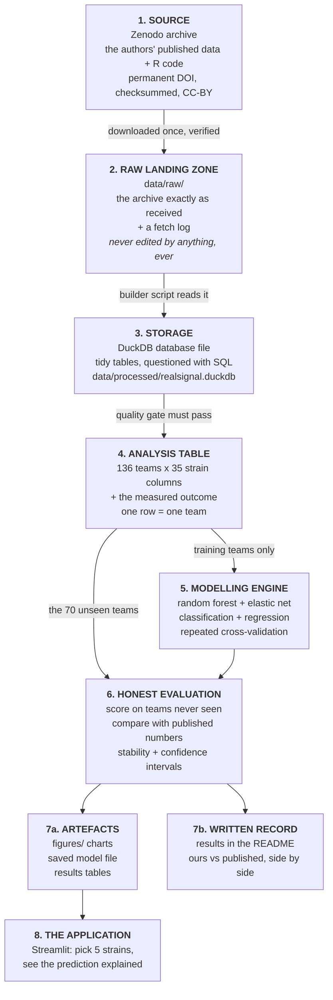

# 00 — Architecture: how it all fits together

**Prerequisites:** none. This is the first document. You do not need to
have installed anything yet, and you do not need any programming or
biology background.

**Learning goal:** after reading this you will be able to draw the
whole system from memory, name every piece, say what it does, say *why
it exists*, and explain what would go wrong if you removed it. You will
also understand the words *pipeline*, *database*, *backend*, *frontend*
and *model* well enough to use them in conversation without bluffing.

**Time:** about 25 minutes to read. No commands to run.

> Every term below is also in [`GLOSSARY.md`](GLOSSARY.md).

---

## 1. Why architecture comes before code

When people begin a data project, the instinct is to open a file and
start typing. That instinct produces the single most common outcome in
amateur data work: a folder containing `analysis.py`,
`analysis_v2.py`, `analysis_final.py`, `analysis_final_REAL.py`, one
enormous spreadsheet that has been edited by hand, and no way on earth
to tell how any number was produced.

**An everyday analogy.** Nobody builds a house by buying bricks and
starting at whichever corner feels good. Someone draws a plan first:
where the load-bearing walls go, where water comes in, where it drains
out. The plan is boring, takes a morning, and prevents the discovery six
weeks later that the bathroom has no drain.

This document is the plan. The single most useful idea in it is this
one:

> **Data flows in one direction, through stages, and each stage has
> exactly one job.**

That shape has a name — a **pipeline** — and it is how essentially all
professional data systems are built.

**Analogy for a pipeline:** a factory line. Raw material comes in one
end. Each station does one thing and passes the result along. Nobody
reaches back down the line to fiddle with an earlier station's output.
When a fault appears, you inspect station by station until you find
where good material became bad, and because each station does one job,
you can actually tell.

---

## 2. The whole system on one page



Read it as a sentence:

> Take the authors' published data, keep an untouched copy, tidy it
> into a database, check the tidy version is sane, train models on the
> training teams only, judge them on teams they have never seen, put our
> numbers next to the published numbers honestly, and wrap the result in
> something a non-programmer can click.

The rest of this document walks the eight boxes one at a time.

---

## 3. Box 1 — The source

**What it is.** A permanent public archive on **Zenodo** (a free
repository for research data, run by CERN) containing the data and the
original R code from the published study, released under a CC-BY 4.0
licence. Its permanent address is a **DOI**:
<https://doi.org/10.5281/zenodo.10118600>.

**Why a DOI and not just a link.** Ordinary web links rot. Universities
reorganise their websites, laboratories move, hosting expires — and a
paper from 2019 pointing at `somelab.uni.edu/data/final2.zip` is,
today, quite often pointing at nothing. A DOI is a permanent identifier
with a promise attached: it will keep resolving to the same object.

*Analogy:* an ISBN identifies a book no matter which shop stocks it;
"the third shelf in the corner shop" identifies a book only until
someone rearranges the shop.

**Why this matters for us specifically.** The entire premise of this
project is that a published result can be independently rebuilt. That
premise dies immediately if the data cannot be found. The fact that
this study deposited its data on Zenodo, under an open licence, with a
DOI, is precisely why it can be reproduced — and it is worth noticing
that this is still not universal practice.

**What we never do.** We never edit anything at the source, and we
never redistribute the authors' data inside our repository. Users
download it themselves, from the original archive, under its original
licence, with the original creators credited. That keeps the
attribution chain honest.

---

## 4. Box 2 — The raw landing zone

**What it is.** A folder, `data/raw/`, holding the downloaded archive
exactly as it arrived, plus a small **fetch log** recording what was
downloaded, when, from where, and what its checksum was.

**The single most important rule in this project:** *nothing ever
writes to `data/raw/` except the download script, and nothing ever
edits what is in it.*

**Why.** Because it is the only thing you can fall back to. Every other
file in the project can be regenerated by running code. The raw copy
cannot — if you edit it, the original is gone, and every number you
subsequently produce is unverifiable.

*Analogy:* photographers keep the original negatives and edit prints.
You can make a hundred prints, discard ninety-nine and start again. You
cannot un-scribble on a negative.

**What the checksum is for.** A **checksum** (here, an MD5 hash) is a
short code computed from a file's exact contents; change one byte and
the code changes completely. Zenodo publishes the archive's checksum;
our script computes it after downloading and compares. If they match,
we have provably got exactly the file the authors deposited — not a
truncated download, not a corrupted one, not a different version.

*Analogy:* the tamper-evident seal on a medicine bottle. It does not
tell you the medicine works; it tells you nobody opened it on the way.

**Why the fetch log matters.** In a year's time, "where did this data
come from?" must have a written answer that does not depend on anyone's
memory. That is called **provenance**, and it is the difference between
a result and a rumour.

---

## 5. Box 3 — Storage: what a database is and why we use one

### What a database actually is

A **database** is an organised store of tables, designed to be
questioned efficiently.

*Analogy:* imagine a filing cabinet where every document is in a
labelled folder, folders are in labelled drawers, and there is an index
at the front. Now imagine the alternative: the same documents in a pile
on the floor. Both contain the same information. Only one lets you
answer "how many invoices from March mention shipping?" in under a
minute.

**SQL** (Structured Query Language) is the near-universal language for
asking those questions. It reads close to English:

```sql
SELECT strain_name, COUNT(*) AS teams_containing
FROM syncom_composition
GROUP BY strain_name
ORDER BY teams_containing DESC;
```

That says: *for each strain, count how many teams it appears in, and
list them commonest first.* You will write your first one in Phase 2
and it will feel less mysterious than it looks.

### Why a database rather than just files

A fair question, since our data is small — 136 rows. Four reasons:

1. **Questions become one line instead of a script.** Filtering,
   grouping and joining are what SQL is *for*.
2. **Types are enforced.** A database column declared as a number
   refuses to hold the text `"n/a"`. Spreadsheets happily accept it,
   and then your averages are silently wrong. This is a real and common
   way analyses go bad.
3. **One source of truth.** Every later stage reads the same tables, so
   two charts cannot disagree because they were built from two
   different exports.
4. **It is the transferable skill.** SQL is asked for in nearly every
   data role, and the SQL you write against DuckDB is very close to the
   SQL you would write against a large cloud warehouse.

### Why DuckDB in particular

**DuckDB** is a complete analytics database that lives in a *single
file* on your laptop. No server to install, no account, no password, no
cost, works identically on Windows, macOS and Linux.

*Analogy:* most databases are like a warehouse — powerful, and you must
first rent the building, install the shelving and hire a security
guard. DuckDB is a filing cabinet you carry in one hand and open on the
kitchen table.

**What we considered instead:**

| Option | Why not, here |
|---|---|
| CSV files only | No types, no querying, easy to corrupt by opening in Excel. Fine for tiny things, not for a project that claims rigour. |
| SQLite | Excellent and similar in spirit, but designed for many small transactions (apps, phones) rather than for scanning columns of numbers, which is exactly what analysis does. |
| PostgreSQL | A superb full database server — and installing, starting and securing a server is a genuine burden that teaches you sysadmin, not analysis. Right answer for a multi-user product, wrong answer here. |
| Cloud warehouse (Snowflake, BigQuery) | Requires an account, a credit card on file, and network access. Overkill for 136 rows, and a real risk of accidental cost. |

**The bonus.** DuckDB is deliberately close to cloud warehouses in
behaviour, so the habits you build here — thinking in tables, writing
analytical SQL — transfer directly if you later work on one.

---

## 6. Box 4 — The analysis table

**What it is.** One tidy table where **one row is one team**:

| syncom_id | experiment | Leaf15 | Leaf68 | Leaf76 | … (32 more strains) | log10_pathogen | protected |
|---|---|---|---|---|---|---|---|
| MIX_001 | 1 | 1 | 0 | 0 | … | 7.41 | 0 |
| MIX_002 | 1 | 0 | 1 | 1 | … | 5.02 | 1 |

The 35 strain columns are the **presence/absence matrix**: 1 if that
strain was on that team, 0 if not. Because every team has exactly five
strains, every row contains exactly five 1s and thirty 0s.

**Why this shape.** Machine-learning models want a rectangle: rows are
cases, columns are features, plus one column holding the answer. Almost
every dataset in the world arrives in some other shape, and converting
it is genuine work — often most of the work. Turning the authors'
measurement files into this rectangle *is* Phase 2.

**The quality gate.** Before anything is modelled, automated checks
must pass. Do we have the expected number of teams? Does every row have
exactly five strains? Is every outcome inside a biologically plausible
range? Are the test teams genuinely absent from the training set?

**Why gates exist.** An analysis of broken data does not crash — it
produces confident, well-formatted, wrong answers. That is far more
dangerous than an error message.

*Analogy:* zeroing the scales before you weigh anything. It takes two
seconds and it is the difference between a measurement and a number.

---

## 7. Box 5 — The modelling engine

**What a model is.** A model is a pattern learned from examples, in a
form that can make predictions about new cases. You have one in your
head for recognising a friend's handwriting: nobody gave you the rules,
you saw enough examples.

**What ours does.** Given the five strains on a team, predict the
outcome — either as a category (protective / not protective) or as a
number (how much pathogen).

**The two models we use, and why two.**

**Random forest.** A crowd of decision trees, each trained on a
slightly different slice of the data, whose votes are combined.
*Analogy:* asking a hundred reasonably informed people rather than one
expert — individual errors cancel out. It handles interactions between
features naturally, which matters enormously here: the whole biological
point is that strains behave differently in company.

**Elastic net.** A linear model with a strict weight limit that pushes
useless features' weights to zero. *Analogy:* packing for a trip with a
baggage allowance — only genuinely useful items survive. It gives a
short, readable list of which strains matter and in which direction.

Using both is not indecision, it is evidence. If a flexible,
interaction-hungry model and a rigid, simplicity-loving model
independently point at the same three strains, that agreement is worth
more than either result alone. The source study used exactly this pair,
which also makes our comparison a fair one.

**What we deliberately do not use.** Deep learning. With 136 rows and
35 features, a neural network would overfit spectacularly, be
impossible to interpret, and demonstrate poor judgement rather than
advanced skill. Choosing the right-sized tool *is* the skill.

---

## 8. Box 6 — Honest evaluation (the part that matters most)

This box is where most amateur projects quietly fail, so it gets the
longest explanation.

### The trap

Train a model, ask it to predict the data it was trained on, report
that it was 99% right. It looks superb. It is meaningless.

*Analogy:* grading students on the exact questions you gave them the
answers to. Everyone scores brilliantly and you have learned nothing
about whether anyone understands the subject.

The failure has a name — **overfitting** — and it means the model
memorised the noise instead of learning the pattern.

### The defences, in the order we apply them

**1. A held-out test set.** The source study ran a *separate
experiment* (Experiment 3) producing 70 new teams, none of which
matches a training team. Those teams are locked away and touched
exactly once, at the very end.

This is unusually strong. Most projects split one dataset into two
parts, which still shares all the quirks of one experimental run.
A test set generated by a physically separate experiment tests
something much closer to the real question: *does this hold up next
time?*

**2. Cross-validation during development.** While tuning, we split the
training data into five parts, train on four and test on the fifth,
rotating so each part gets a turn. This gives a reliable performance
estimate without ever touching the real test set.

*Analogy:* five practice papers covering different chapters, before the
real exam.

**3. Grouping to prevent leakage.** Several plants received the same
team. If plants from one team landed on both sides of a split, the
model would effectively be tested on cases it had already seen — a
subtle form of **data leakage**. The source study explicitly kept all
plants of a team together, and so do we. Phase 4 includes a test that
fails if this is ever violated.

**4. Baselines.** Every score is reported next to what a trivial
strategy achieves: random guessing for classification, always
predicting the average for regression. **A performance number without a
baseline is not a result.** "84% accurate" is impressive against 50%
and embarrassing against 83%. The source paper reports both, which is a
mark of careful work.

**5. Multiple seeds.** Random choices inside model training make
results wobble slightly. Reporting the best of eight runs is a way of
lying to yourself politely. We report the spread across seeds — as the
source study did.

**6. Confidence intervals.** 70 test teams is not many. Saying "84%"
without saying how uncertain that is overstates what small data can
support.

### And then: the comparison

Finally we put our numbers beside the published numbers and say plainly
where they agree and where they don't — including any place we fall
short. A reproduction that reports only its successes is not a
reproduction, it is an advertisement.

---

## 9. Boxes 7 and 8 — Serving: artefacts, and the application

### Backend, frontend, database — the three words, plainly

These get used constantly and are rarely explained. Picture a
restaurant:

- The **frontend** is the dining room. What the customer sees and
  touches: the menu, the table, the waiter. In software: the buttons,
  charts and text on screen.
- The **backend** is the kitchen. Where the actual work happens, out of
  sight. In software: the code that loads the model, runs the
  prediction, and does the arithmetic.
- The **database** is the pantry. Where ingredients are stored between
  services, organised so the kitchen can find them fast.

A customer never enters the kitchen and never rummages in the pantry.
They read a menu and receive a plate. That separation is the whole
idea, and it is why professional systems keep the three apart: you can
redecorate the dining room without closing the kitchen, and you can
replace the oven without reprinting the menus.

### Our serving layer, in two parts

**Artefacts** — charts saved as image files, the trained model saved to
disk, results tables written out. These are what get embedded in the
README and shared. They are produced by code and can always be
regenerated, which means no number in this project will ever have been
typed in by hand.

**The application** — a **Streamlit** app. Streamlit turns a Python
script into a web page with controls, without requiring any web
development. The user picks five strains from a list and sees the
predicted outcome, how confident the model is, and a plain-language
explanation of which strains drove the prediction.

*Analogy:* the analysis, but with knobs anyone can turn — including
somebody who would never open a terminal.

**Why an app at all?** Because a result that only its author can
reproduce is not much use to anyone. The app is the difference between
"I ran an analysis" and "I built something people can use". In this
project Streamlit is deliberately small and honest: it exposes the
model, states its limits on screen, and does not pretend to be
agricultural advice.

**Why not React and a proper API?** That is the professional next step,
and it is on the roadmap with an explanation. For one model, one user
and one screen, a full frontend framework plus a separate backend
service is several weeks of work to achieve the same thing Streamlit
does in an afternoon. Knowing when *not* to reach for the heavy tool is
part of the craft.

---

## 10. The two ways to run everything

Every capability in this project is runnable two ways, on purpose:

**Manually, as scripts.** Each phase produces a script you can run line
by line, reading the output as it goes. This is how you *learn* — you
see each intermediate result and can poke at it.

```bash
python scripts/fetch_data.py --probe
python scripts/fetch_data.py
```

**Automatically, as one command.** By the final phase, one command runs
the entire pipeline in the correct order, with the automated tests as a
final gate. This is how you *use* it, and it is the proof the project
holds together.

Both paths call exactly the same underlying functions. There is no
second copy of the logic — a "demo version" that has drifted from the
real one is a classic source of embarrassment.

---

## 11. What lives where, and why

```
realsignal/
├── docs/          ← the tutorial. The main deliverable, not an afterthought.
├── scripts/       ← standalone tools you run by hand, one job each.
├── src/realsignal/← the engine: importable, reusable, tested functions.
├── notebooks/     ← exploration: messy thinking, kept honest and separate.
├── tests/         ← automated checks that the engine does what it claims.
├── app/           ← the Streamlit application.
├── figures/       ← charts produced from real data by code, never by hand.
└── data/          ← NOT in Git. Regenerated by scripts/fetch_data.py.
```

**Why `src/` and `scripts/` are separate.** Code in `src/` is written to
be *imported* — small functions with one job, which tests can call
directly. Code in `scripts/` is written to be *run* — it handles
command-line arguments, prints progress, and calls the functions in
`src/`. Keeping them apart is what makes testing possible at all: you
cannot easily test a 400-line script, but you can absolutely test a
12-line function.

*Analogy:* `src/` is the set of kitchen tools; `scripts/` are the
recipes that use them. A tool that only exists inside one recipe cannot
be reused or checked.

**Why `notebooks/` is separate too.** Notebooks are wonderful for
exploring and terrible as a foundation, because they can be run out of
order and produce results nobody can reproduce. This project's rule:
explore in notebooks, then move anything worth keeping into `src/` with
a test.

**Why `data/` is not in Git.** Version control is designed for text you
edit, not a 239 MB binary archive. More importantly, if the data can be
regenerated by a script, *the script working is the proof the project
works*. Anyone can clone this and rebuild byte-identical data, verified
by checksum — a stronger guarantee than a committed copy nobody can
check.

---

## 12. The full stack, and why each piece won

| Tool | What it is, plainly | Why it wins here | What we didn't pick |
|---|---|---|---|
| **Python 3.11+** | The programming language | The standard language for machine learning; readable; identical on all three operating systems | R — which is what the original used, and that is exactly the point: rebuilding in a different language is stronger evidence |
| **pandas** | Tables, driven by typed instructions | Every step recorded and repeatable, unlike spreadsheet clicking | Excel — invisible manual edits, no history |
| **NumPy** | Fast arithmetic on blocks of numbers | Sits underneath pandas and scikit-learn anyway | — |
| **scikit-learn** | The standard ML library | Has both the models *and* the honest-evaluation tools in one box | PyTorch/TensorFlow — deep learning would overfit 136 rows badly |
| **DuckDB** | A database in a single file | SQL with zero setup, built for analytical tables, no cost | SQLite (transaction-shaped), PostgreSQL (server burden), cloud (accounts and cost risk) |
| **matplotlib** | Charts from code | Universal, no dependencies to fight, saves reproducible image files | Charting by hand in a spreadsheet — unreproducible |
| **Streamlit** | Python script → web app | Fastest honest route from model to something clickable | React + FastAPI — the professional path, on the roadmap, weeks of work for the same outcome here |
| **pytest** | Automated checks | Catches your own mistakes before anyone else does | Manual re-checking — reliable until you are tired |
| **venv** | A sealed toolbox per project | Stops projects breaking each other; makes the environment reproducible | Installing packages system-wide — the classic route to "it worked yesterday" |
| **Git + GitHub** | Save-game system + shared home | Version control is the baseline expectation for any technical work | Nothing worth considering |

Everything on that list is free, open source, and runs identically on
Windows, macOS and Linux.

---

## 13. Checkpoint

You have finished this document when you can answer these without
scrolling up. Try them honestly — it takes two minutes and it is the
difference between having read and having understood.

1. What are the eight boxes, in order?
2. Why must `data/raw/` never be edited?
3. What does a checksum prove, and what does it *not* prove?
4. Give one reason a database beats a folder of CSV files.
5. In the restaurant analogy, which is the frontend, which the backend,
   which the database?
6. Why is testing a model on its training data meaningless?
7. What makes this project's test set unusually strong?
8. Why is a performance number without a baseline not a result?
9. Why do we use two different model types rather than the best one?
10. Why is `data/` deliberately kept out of Git?

If any answer is shaky, the section that covers it is worth a second
read now rather than in three weeks when it silently costs you a day.

---

## 14. Committing this document

You have not written code yet, but you have produced something worth
keeping — and the habit of committing at every checkpoint starts here,
not later when it "gets serious".

If you have not set up Git or the repository yet, that is the very next
document ([`01-setup.md`](01-setup.md)); come back to this step
afterwards. If you have, the ritual is:

```bash
git switch develop
git add -A
git commit -m "docs: add architecture overview"
git push origin develop develop:beta develop:master

git switch master
git pull --ff-only origin master
git switch develop
```

Every word of that is explained in [`GIT_WORKFLOW.md`](GIT_WORKFLOW.md).

---

## 15. If you want to use Claude Code for this phase

Claude Code is a tool that edits files in your repository from the
command line. If you use it, this is a good prompt to give it once the
repository exists:

> Read `docs/00-architecture.md` in this repository. Create the empty
> folder structure it describes (`scripts/`, `src/realsignal/`,
> `notebooks/`, `tests/`, `app/`, `figures/`, `data/raw/`,
> `data/processed/`), adding a `.gitkeep` file in each so Git tracks the
> empty folders. Create `src/realsignal/__init__.py` as an empty file.
> Do not create any other files, and do not write any analysis code
> yet. Then show me the resulting tree.

---

**Next:** [`01-setup.md`](01-setup.md) — turning a blank laptop into a
working workshop, on Windows, macOS or Linux.
