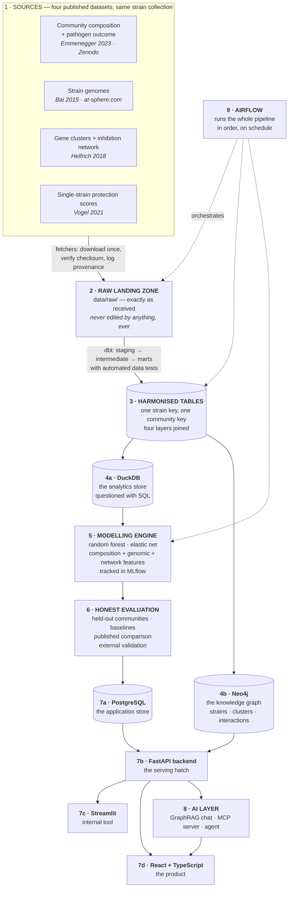

# 00 — Architecture: how it all fits together

**Prerequisites:** none. This is the first document. You do not need to
have installed anything, and you need no programming or biology
background.

**Learning goal:** after reading this you will be able to draw the whole
system from memory, name every piece, say what it does and *why it
exists*, and explain what would go wrong if you removed it. You will
also understand *pipeline*, *database*, *backend*, *frontend*, *API*,
*orchestration*, *model*, *knowledge graph* and *agent* well enough to
use them in conversation without bluffing.

**Time:** about 40 minutes to read. No commands to run.

> Every term below is also in [`GLOSSARY.md`](GLOSSARY.md). The
> phase-by-phase build plan is in [`ROADMAP.md`](ROADMAP.md).

---

## Contents

- [1. Why architecture comes before code](#1-why-architecture-comes-before-code)
- [2. The whole system on one page](#2-the-whole-system-on-one-page)
- [3. Layer 1 — The sources](#3-layer-1--the-sources)
- [4. Layer 2 — The raw landing zone](#4-layer-2--the-raw-landing-zone)
- [5. Layer 3 — Harmonisation, and what dbt is](#5-layer-3--harmonisation-and-what-dbt-is)
- [6. Layer 4 — Storage, and why there are two databases](#6-layer-4--storage-and-why-there-are-two-databases)
- [7. Layer 5 — The modelling engine](#7-layer-5--the-modelling-engine)
- [8. Layer 6 — Honest evaluation](#8-layer-6--honest-evaluation)
- [9. Layer 7 — Serving: backend, frontend, and the words explained](#9-layer-7--serving-backend-frontend-and-the-words-explained)
- [10. Layer 8 — The AI layer](#10-layer-8--the-ai-layer)
- [11. Layer 9 — Orchestration, and what Airflow is](#11-layer-9--orchestration-and-what-airflow-is)
- [12. The data product: who uses this, and for what](#12-the-data-product-who-uses-this-and-for-what)
- [13. Two ways to run everything](#13-two-ways-to-run-everything)
- [14. What lives where, and why](#14-what-lives-where-and-why)
- [15. The full stack, and why each piece won](#15-the-full-stack-and-why-each-piece-won)
- [16. Checkpoint](#16-checkpoint)

---

## 1. Why architecture comes before code

When people begin a data project, the instinct is to open a file and
start typing. That instinct produces the commonest outcome in amateur
data work: a folder containing `analysis.py`, `analysis_v2.py`,
`analysis_final.py`, `analysis_final_REAL.py`, one enormous spreadsheet
edited by hand, and no way to tell how any number was produced.

**An everyday analogy.** Nobody builds a house by buying bricks and
starting at whichever corner feels good. Someone draws a plan first:
where the load-bearing walls go, where water comes in, where it drains.
The plan is boring, takes a morning, and prevents the discovery six
weeks later that the bathroom has no drain.

This document is the plan. The single most useful idea in it:

> **Data flows in one direction, through stages, and each stage has
> exactly one job.**

That shape has a name — a **pipeline** — and it is how essentially all
professional data systems are built.

**Analogy for a pipeline:** a factory line. Raw material in at one end.
Each station does one thing and passes the result along. Nobody reaches
back down the line to fiddle with an earlier station's output. When a
fault appears you inspect station by station — and because each station
does one job, you can actually find it.

---

## 2. The whole system on one page

This is the finished system. Today, Layers 1 and 2 are built; the rest
is planned, phase by phase, in [`ROADMAP.md`](ROADMAP.md). Reading the
whole map first is worth it: every later decision makes more sense when
you can see where it leads.



Read it as a sentence:

> Take four published datasets about the same bacteria; keep untouched
> copies; harmonise them onto one key with a tested transformation
> pipeline; store the result two ways — as tables for analysis and as a
> graph for relationships; train models on the training communities
> only; judge them on communities never seen and against an independent
> study; serve the result through an API to a prototype tool, a
> production interface and an AI layer; and have an orchestrator run
> the whole thing on schedule.

The rest of this document walks the layers one at a time.

---

## 3. Layer 1 — The sources

**What they are.** Four published datasets, all describing the **same
strain collection** — the *At*-LSPHERE, a library of bacteria isolated
from wild *Arabidopsis* leaves. That shared collection is what makes
joining them possible: the strain identifier (`Leaf15`, `Leaf76`) is
the key that runs through everything.

| Source | What it contributes | Question it answers |
|---|---|---|
| Community composition + outcome | 136 training + 70 test communities | *Which communities protect?* |
| Strain genomes | The genetic blueprint of each strain | *What could each strain do?* |
| Gene clusters | >1,000 predicted natural-product clusters | *What chemistry can each make?* |
| Inhibition network | ~50,000 pairwise strain interactions | *How do they affect each other?* |
| Single-strain protection scores | Each strain tested alone | *An independent check on our ranking* |

**Why more than one source.** One dataset answers one question. The
genomic layer turns a statistical result into a mechanism: if the
strains the model ranks highly also carry more antibiotic-producing
gene clusters, you have gone from *which* to *why*. That chain — genome
→ chemistry → observed behaviour — is what **multi-omics integration**
means, and it is the technical heart of this project.

**Why DOIs matter.** Ordinary web links rot. A 2019 paper pointing at
`somelab.uni.edu/data/final.zip` today quite often points at nothing. A
**DOI** is a permanent identifier with a promise: it keeps resolving to
the same object. *Analogy:* an ISBN identifies a book regardless of
which shop stocks it; "third shelf, corner shop" does not.

**What we never do.** We never edit anything at source, and we never
redistribute other people's data inside this repository. Fetchers
download from the original archives, so everyone receives the data from
its source with the licence and the authors' names attached.

> **Status note.** Only the first source is confirmed and downloaded.
> The others come from papers whose supplementary data may or may not
> be freely accessible; Phase 2 begins by checking and recording the
> answer either way. The project is built so the first source alone
> supports a complete reproduction — every further layer is an
> enhancement, not a dependency.

---

## 4. Layer 2 — The raw landing zone

**What it is.** `data/raw/` — every downloaded file exactly as it
arrived, plus a fetch log recording what came from where, when, and
with what checksum.

**The single most important rule in this project:** *nothing writes to
`data/raw/` except the fetchers, and nothing ever edits what is there.*

**Why.** It is the only thing you cannot regenerate. Every other file
can be rebuilt by running code. Edit the raw copy and the original is
gone, and every number you produce afterwards is unverifiable.

*Analogy:* photographers keep the original negatives and edit prints.
Make a hundred prints, discard ninety-nine, start again. You cannot
un-scribble on a negative.

**What a checksum is for.** A short code computed from a file's exact
contents; change one byte and it changes completely. The archive
publishes its checksum; our fetcher computes it after downloading and
compares. A match proves we have exactly the file that was deposited.

*Analogy:* the tamper-evident seal on a medicine bottle. It proves
nobody opened it in transit. It says nothing about whether the medicine
works — and knowing precisely what a check does *not* tell you is part
of doing this well.

**Why the fetch log matters.** In a year, "where did this come from?"
must have a written answer that does not depend on memory. That is
**provenance** — the difference between a result and a rumour.

---

## 5. Layer 3 — Harmonisation, and what dbt is

### The problem

Four sources, produced by different laboratories, years apart. The same
strain may appear as `Leaf15`, `leaf_15`, or `Pseudomonas Leaf15`.
Tables have different shapes. Some strains appear in one source and not
another.

**Harmonisation** is making them agree: one identifier, one shape, one
set of rules about what to do when they disagree. On real multi-source
projects this is usually the largest single piece of work, and it is
most often done invisibly — buried inside a script nobody can audit.

*Analogy:* three colleagues send you attendance lists for the same
meeting. One uses full names, one initials, one email addresses. Before
you can count anything, someone must decide who is who — and write the
decisions down, so the count can be checked later.

### What dbt is

**dbt** turns a folder of SQL files into a transformation pipeline with
dependencies, automated tests and generated documentation.

*Analogy:* your recipes were loose sheets of paper. dbt turns them into
a cookbook with a contents page, an index, a note on every page saying
which other pages must be cooked first — and a set of checks that
refuse to serve the dish if the sauce came out wrong.

Three things it gives you that a script does not:

1. **Lineage.** It knows every table's ancestry and can draw it. "Where
   did this column come from?" becomes a diagram, not an archaeology
   project.
2. **Tests inside the pipeline.** *Every strain identifier is unique.
   No outcome is missing. Every community has exactly five members.
   Every strain named in a community exists in the strain table.* These
   run on every build, and a failure stops the pipeline.
3. **Documentation that cannot drift.** Descriptions live beside the
   models and are published as a browsable site.

**Why it matters here.** An analysis of broken data does not crash — it
produces confident, well-formatted, wrong answers. That is far more
dangerous than an error message.

*Analogy:* zeroing the scales before weighing anything. Two seconds,
and the difference between a measurement and a number.

dbt Core is free and runs against DuckDB locally. The same SQL can be
pointed at a cloud warehouse by changing one configuration profile —
which makes "could this run in the cloud?" a documented one-line answer
instead of a rewrite.

---

## 6. Layer 4 — Storage, and why there are two databases

### What a database actually is

An organised store of tables designed to be questioned efficiently.

*Analogy:* a filing cabinet where every document is in a labelled
folder, folders in labelled drawers, with an index at the front. The
alternative is the same documents in a pile on the floor. Both hold the
same information; only one lets you answer "how many invoices from
March mention shipping?" in under a minute.

**SQL** is the near-universal language for asking those questions:

```sql
SELECT strain_name, COUNT(*) AS communities_containing
FROM community_membership
GROUP BY strain_name
ORDER BY communities_containing DESC;
```

*For each strain, count how many communities it appears in, commonest
first.* You will write your first one in Phase 3.

### Why two — and later, three

Different jobs. Using each tool where it belongs, and being able to say
why, matters more than picking a favourite.

| Store | Job | Analogy |
|---|---|---|
| **DuckDB** | Analytics. Scanning whole columns fast, one analyst at a time. | A research library where you spread twenty books across a table |
| **PostgreSQL** | The application. Many small reads and writes, many users at once, always available. | A busy pharmacy counter serving a queue |
| **Neo4j** | Relationships. Following chains of connections. | A detective's pinboard with string between the photographs |

The distinction between the first two has proper names: **OLAP**
(analytical — few big questions) versus **OLTP** (transactional — many
small ones). Making one database do both jobs well is a classic source
of slow, fragile systems.

**Why DuckDB rather than something bigger?** It is a complete analytics
database in a *single file*: no server, no account, no cost, identical
on all three operating systems. *Analogy:* most databases are a
warehouse — powerful, once you have rented the building and hired a
security guard. DuckDB is a filing cabinet you open on the kitchen
table.

**Why Neo4j at all?** Because one data layer is literally a network:
~50,000 measured strain-to-strain inhibition relationships. Flattening
that into tables loses structure that matters. A question like *"which
strains inhibit the pathogen's close relatives and also carry
antibiotic gene clusters?"* is awkward SQL and natural in a graph.
Forcing a graph onto tabular data would be ornamental; this is the
opposite case.

---

## 7. Layer 5 — The modelling engine

**What a model is.** A pattern learned from examples, in a form that
can make predictions about new cases. You have one in your head for
recognising a friend's handwriting: nobody gave you the rules, you saw
enough examples.

**What ours does.** Given a five-strain community, predict the outcome
— as a category (protective or not) or as a number (how much pathogen).

### Two models, and why two

**Random forest.** A crowd of decision trees, each trained on a
slightly different slice, whose votes combine. *Analogy:* asking a
hundred reasonably informed people rather than one expert — individual
errors cancel. It handles interactions between features naturally,
which matters here because the entire biological point is that strains
behave differently in company.

**Elastic net.** A linear model with a strict weight limit that pushes
useless features' weights to zero. *Analogy:* packing with a baggage
allowance — only genuinely useful items survive. It yields a short,
readable list of which strains matter and in which direction.

Using both is evidence, not indecision. If a flexible,
interaction-hungry model and a rigid, simplicity-loving one
independently point at the same three strains, that agreement is worth
more than either alone.

### Three kinds of feature

This is where multi-omics integration actually happens:

1. **Composition** — which strains are present (35 columns of 1s and 0s)
2. **Genomic** — what chemistry those strains can make (gene-cluster
   counts by class)
3. **Network** — how antagonistic the community is internally, and how
   strongly its members inhibit the pathogen's relatives

Then the honest question: does adding features 2 and 3 actually improve
prediction over 1 alone? **It may not** — the original study found
strain identity alone highly predictive. If the extra layers add
nothing, that is a real result and will be reported as one. Testing
whether added complexity helps, rather than assuming it does, is the
skill.

### Experiment tracking

**MLflow** records every training run's settings, metrics and resulting
model. *Analogy:* a laboratory notebook that fills itself in, so "which
settings produced that result?" always has an answer.

### What we deliberately do not use

Deep learning. With 136 training rows, a neural network would overfit
spectacularly and be impossible to interpret — and the entire point is
*which strains matter*, which requires interpretability. Choosing the
right-sized tool is the skill; reaching for the most impressive one is
not.

---

## 8. Layer 6 — Honest evaluation

This is where most amateur projects quietly fail, so it gets the
longest explanation.

### The trap

Train a model, ask it to predict the data it was trained on, report 99%
accuracy. It looks superb. It is meaningless.

*Analogy:* grading students on the exact questions you gave them the
answers to. Everyone scores brilliantly and you have learned nothing.

The failure is called **overfitting**: the model memorised the noise
instead of learning the pattern.

### The defences, in order

**1. A held-out test set.** The source study ran a *separate
experiment* producing 70 new communities, none matching a training one.
Locked away, touched once, at the end. This is unusually strong — most
projects split one dataset in two, which still shares every quirk of a
single experimental run.

**2. Cross-validation during development.** Split the training data
into five parts, train on four, test on the fifth, rotate. *Analogy:*
five practice papers before the real exam.

**3. Grouping to prevent leakage.** Several plants received the same
community. If plants from one community landed on both sides of a
split, the model would be tested on cases it had effectively seen —
**data leakage**. The original study kept all plants of a community
together; so do we, with an automated test that fails if it is ever
violated.

**4. Baselines.** Every score reported beside what a trivial strategy
achieves. **A performance number without a baseline is not a result.**
"84% accurate" is impressive against 50% and embarrassing against 83%.

**5. Multiple seeds.** Random choices make results wobble. Reporting
the best of eight runs is a way of lying to yourself politely.

**6. Confidence intervals.** Seventy test communities is not many.
Saying "84%" without saying how uncertain it is overstates what small
data supports.

### Then: two comparisons

**Against the published numbers** — ours beside theirs, including
disagreements. A reproduction reporting only its successes is an
advertisement, not a reproduction.

**Against an independent study** — our model learns which strains
matter *from communities only*, never seeing any strain tested alone.
A separate laboratory study measured exactly that. Comparing the two
rankings tests the conclusion against evidence the model never touched,
and the disagreements are the interesting part: a strain that only
works in company is a genuinely different finding from one that works
alone.

---

## 9. Layer 7 — Serving: backend, frontend, and the words explained

### The three words, plainly

Picture a restaurant:

- The **frontend** is the dining room. What the customer sees and
  touches: the menu, the table, the waiter. In software: buttons,
  charts, text on screen.
- The **backend** is the kitchen. Where the work happens, out of sight.
  In software: the code that loads the model, runs the prediction, does
  the arithmetic.
- The **database** is the pantry. Where ingredients are stored between
  services, organised so the kitchen finds them fast.

A customer never enters the kitchen and never rummages in the pantry.
They read a menu and receive a plate. That separation is why
professional systems keep the three apart: you can redecorate the
dining room without closing the kitchen, and replace the oven without
reprinting the menus.

### What an API is

An **API** (application programming interface) is a defined set of
addresses another program can call to ask your system for something.

*Analogy:* the serving hatch between kitchen and dining room. Orders
in, plates out, through one well-defined opening — and nobody wanders
into the kitchen.

**FastAPI** is the Python framework we use to build it. It validates
every incoming request against a declared shape (so a malformed request
is rejected clearly rather than causing a mysterious failure deep
inside) and generates interactive documentation automatically.

### Three ways in, one engine

| Interface | For whom | Built in |
|---|---|---|
| **Streamlit** | The analyst — a quick internal tool | Phase 6 |
| **React + TypeScript** | The end user — the product | Phase 10 |
| **MCP server** | An AI assistant | Phase 14 |

All three call the same FastAPI backend, which calls the same tested
functions in `src/`. **There is no second copy of the logic.** A "demo
version" that has drifted from the real one is a classic source of
embarrassment.

**Why Streamlit first, then React?** Streamlit turns a Python script
into a web page with controls in an afternoon, with no web development.
That gets a working product early, which keeps the project grounded in
"who would use this, and for what?" React is the professional path —
more work, far more control, and the shape of a real application. Doing
Streamlit first is not a detour; it is how sensible teams sequence
things.

**What TypeScript adds over JavaScript:** types. *Analogy:* seatbelts.
JavaScript will happily let you add a number to a sentence and find out
at three in the morning; TypeScript stops you in the editor.

### Containers — the whole thing in a box

A **container** packages a program together with everything it needs to
run: the interpreter, the system libraries, the code, the start-up
instructions.

*Analogy:* shipping a meal with its own kitchen attached, so it cooks
identically in any building — same oven, same gas, same altitude.

The virtual environment from [`01-setup.md`](01-setup.md) seals your
*Python packages*. It does not seal the Python interpreter, the system
libraries, or entirely separate programs like PostgreSQL and Neo4j. A
container seals all of it. *Analogy:* the virtual environment is your
own knife roll; the container is your own kitchen.

**Why this project cares.** Without containers, the setup guide would
need instructions for installing and configuring PostgreSQL, Neo4j,
Node.js and Airflow across three operating systems — a hundred pages
that would still not work reliably. With them, one command starts all
six services, correctly wired, on Windows, macOS or RHEL 8.

**Docker or Podman — both.** They implement the same OCI image
standard, so an image built by one runs under the other; their commands
are near-identical. The differences that matter: Docker runs a
background service with administrator rights, while Podman is
*daemonless* and *rootless* — it runs as your ordinary user, which on a
managed work machine is often the difference between being able to use
containers and not. And decisively: **Red Hat removed Docker from RHEL
8**, where Podman is the shipped default. Supporting both is therefore
a requirement of this project's platform matrix, not a preference.

One set of files serves both. How, exactly — and containers explained
from zero, with installation for all three platforms — is in
[`CONTAINERS.md`](CONTAINERS.md).

**Volumes** are the deliberate exception to a container's
disposability: storage that survives when the container is deleted.
*Analogy:* the paper cups are thrown away after every service; the
fridge stays. Databases live on volumes, which is why restarting the
system does not lose your data.

---

## 10. Layer 8 — The AI layer

Four capabilities, each with a specific job. The order matters: each
builds on the last.

### Knowledge graph and ontology

An **ontology** is an agreed vocabulary for a domain: what kinds of
thing exist and how they may relate. *Analogy:* a family tree for
concepts.

Ours fixes that a **strain** CARRIES a **gene cluster**; a **gene
cluster** PRODUCES a **compound class**; a **strain** INHIBITS a
**strain**; a **community** CONTAINS **strains** and PROTECTS a
**plant**.

Writing that down does real work. It forces agreement on what a
"strain" is across four datasets that describe it differently, and it
makes relationship questions answerable by following links rather than
by writing ever more elaborate joins.

### RAG — retrieval-augmented generation

A language model answering from memory produces fluent, confident,
occasionally invented answers. **RAG** makes it look things up in *your*
data first.

*Analogy:* the difference between a colleague answering from memory and
one who checks the file before replying.

**GraphRAG** goes further: the lookup walks the knowledge graph rather
than only matching text, so a question like *"why might Leaf76 work?"*
can be answered by following the chain — this strain carries these
clusters, which produce these compounds, and it inhibits these
relatives of the pathogen — with every step citable.

**Why this matters here specifically:** in scientific work, an answer
without a source is worthless. Grounding is not a nice extra; it is the
whole requirement.

### MCP — the Model Context Protocol

A standard way to plug tools and data into AI assistants.

*Analogy:* USB. Before it, every device needed its own connector and
its own driver. After it, one socket fits everything.

Wrapping this project as an MCP server means an assistant can query the
model, the database and the graph directly — read-only, with documented
limits. Once the API from Phase 9 exists, this is a thin, well-designed
wrapper: good value for small effort.

### Agents

**Chatbot versus agent:** a chatbot answers; an agent *acts*. It plans
steps, calls tools, looks at the results, and decides what to do next,
looping until the task is done.

*Analogy:* asking a librarian a question, versus asking a research
assistant to go away and come back with a shortlist.

Ours is deliberately narrow: *"suggest three untested five-strain
communities most likely to protect."* It decides which queries to run,
runs them, scores candidates against the model and the graph, and
returns a shortlist with reasoning — with a fixed toolset, a step
limit, and a full log of every action. **An unlogged agent is
unacceptable in any serious setting**, because an action nobody can
review is an action nobody can trust.

---

## 11. Layer 9 — Orchestration, and what Airflow is

Everything so far is a command someone types. That works until it
doesn't: you forget a step, run them out of order, or go on holiday.

**Airflow** is an alarm clock crossed with a checklist that understands
dependencies.

*Analogy:* a kitchen pass that knows the sauce must be ready before the
plate goes out, starts the sauce at the right time, and rings a bell
loudly if it burns.

It gives you four things a script does not:

1. **Order** — declared dependencies, not remembered ones.
2. **Schedule** — it runs itself.
3. **Retries** — a failed download tries again before waking anyone.
4. **Visibility** — a screen showing what ran, when, and what failed.

We build up to it gently: a plain Python runner first, so you
understand what Airflow is replacing before you meet it. Adopting a
tool before feeling the problem it solves is how people end up with
complex systems they cannot debug.

---

## 12. The data product: who uses this, and for what

A system is not a product until you can name the user and the decision.

**The user.** A scientist choosing which strain combinations to test
next.

**Their problem.** Every combination costs weeks of glasshouse work.
A pool of 35 strains yields over 300,000 possible five-strain
communities. You can test perhaps a hundred a year.

**The decision the product supports.** *Which handful should I test
next?*

**The value.** Ranking candidates before committing laboratory time
turns an intractable search into a shortlist.

**How success is measured.** Honestly, and against a real baseline: the
hit rate of recommended communities versus randomly chosen ones,
measured on the held-out data. That number can be computed, and it is
the number that decides whether the product is worth anything.

**What it deliberately does not claim.** The plants were grown sterile,
in sealed boxes, with exactly five known bacteria. That is a scientific
simplification — it is what allows cause and effect to be established
at all — but "Leaf76 protects *Arabidopsis* in a box" does not mean
"Leaf76 will protect wheat in a field in July". The application states
this on screen. A product that overstates its scope is worse than no
product, because it will be believed.

---

## 13. Two ways to run everything

Every capability is runnable two ways, on purpose:

**Manually, as scripts.** Run line by line, reading the output as it
goes. This is how you *learn* — you see each intermediate result and
can poke at it.

```bash
python scripts/fetch_data.py --probe
python scripts/fetch_data.py
```

**Automatically, as one command.** By the end, the whole pipeline runs
in the correct order with tests as a final gate — first via a Python
runner, later via Airflow. This is how you *use* it, and it is the
proof the project holds together.

Both paths call exactly the same underlying functions.

---

## 14. What lives where, and why

```
realsignal/
├── docs/          ← the tutorial. The main deliverable, not an afterthought.
├── scripts/       ← standalone tools you run by hand, one job each.
├── src/realsignal/← the engine: importable, reusable, tested functions.
├── dbt/           ← the harmonisation pipeline          (Phase 3)
├── notebooks/     ← exploration: messy thinking, kept honest and separate.
├── tests/         ← automated checks that the engine does what it claims.
├── api/           ← the FastAPI backend                  (Phase 9)
├── app/           ← the Streamlit prototype              (Phase 6)
├── frontend/      ← the React + TypeScript product       (Phase 10)
├── airflow/       ← the orchestration DAGs               (Phase 11)
├── mcp/           ← the MCP server                       (Phase 14)
├── figures/       ← charts produced from real data by code, never by hand.
└── data/          ← NOT in Git. Regenerated by the fetchers.
```

**Why `src/` and `scripts/` are separate.** Code in `src/` is written to
be *imported* — small functions with one job, which tests can call
directly. Code in `scripts/` is written to be *run* — it handles
arguments, prints progress, and calls the functions in `src/`. Keeping
them apart is what makes testing possible: you cannot easily test a
400-line script, but you can absolutely test a 12-line function.

*Analogy:* `src/` holds the kitchen tools; `scripts/` holds the recipes
that use them. A tool existing only inside one recipe can never be
reused or checked.

**Why `notebooks/` is separate.** Notebooks are wonderful for exploring
and terrible as a foundation, because they can be run out of order and
produce results nobody can reproduce. The rule: explore in notebooks,
then move anything worth keeping into `src/` with a test.

**Why `data/` is not in Git.** Version control is designed for text you
edit, not large binary archives. More importantly, if data can be
regenerated by a script, *the script working is the proof the project
works*. Anyone can clone this and rebuild byte-identical data, verified
by checksum — a stronger guarantee than a committed copy nobody can
check.

---

## 15. The full stack, and why each piece won

Everything here is free and open source, and runs on Windows, macOS and
Linux.

| Tool | What it is, plainly | Why it wins here | What we didn't pick |
|---|---|---|---|
| **Python 3.11+** | The language | The standard for machine learning; identical everywhere | R — which the original used, and that is the point: rebuilding in another language is stronger evidence |
| **pandas / NumPy** | Tables and fast arithmetic | Every step recorded and repeatable | Excel — invisible manual edits, no history |
| **dbt Core** | SQL files → tested, documented pipeline | Harmonising four sources is exactly its job; lineage and tests come free | A bespoke transformation script — works, but nobody can audit it |
| **DuckDB** | A database in one file | SQL with zero setup, built for analytical tables | SQLite (transaction-shaped); a cloud warehouse (accounts, cost risk, disproportionate) |
| **PostgreSQL** | The application database | Many concurrent small operations — what an API needs | Using DuckDB for both — the wrong shape for serving |
| **Neo4j** | A graph database | One data layer *is* a 50,000-edge network | Forcing relationships into ever-larger SQL joins |
| **scikit-learn** | The ML library | Models *and* honest-evaluation tools in one box | Deep learning — would overfit 136 rows badly |
| **MLflow** | Experiment tracking | "Which settings produced that?" always has an answer | A spreadsheet of results, maintained by hand |
| **FastAPI** | The backend framework | Validates requests, documents itself | Flask (less validation), Django (far more than needed) |
| **Streamlit** | Script → web app | A working product in an afternoon | Nothing — this is the right first move |
| **React + TypeScript** | The production frontend | The real shape of an application; types catch mistakes early | Plain JavaScript — no seatbelts |
| **Airflow** | Orchestration | Order, schedule, retries, visibility | cron — no dependencies, no visibility (but we start there deliberately) |
| **Docker / Podman** | Container engines | Identical behaviour on all three operating systems; both read the same files, and Podman is the only supported engine on RHEL 8 | Separate manual install instructions per OS; Kubernetes (fleet-scale, not needed) |
| **pytest** | Automated checks | Catches your mistakes before anyone else does | Manual re-checking — reliable until you are tired |
| **Git + GitHub** | Version control | The baseline expectation for technical work | Nothing worth considering |

For the tools deliberately **excluded** — Spark, Kubernetes, deep
learning, and Snowflake as anything more than an optional portability
exercise — the reasoning is in [`ROADMAP.md`](ROADMAP.md) §6. Knowing
when a tool is the wrong size is part of using tools well.

---

## 16. Checkpoint

You have finished this document when you can answer these without
scrolling up.

1. What are the nine layers, in order?
2. Why does this project use four data sources rather than one?
3. Why must `data/raw/` never be edited?
4. What does a checksum prove, and what does it *not* prove?
5. What does dbt give you that a transformation script does not?
6. Why are there two databases — three, counting the graph?
7. In the restaurant analogy: frontend, backend, database — which is
   which, and where does the API fit?
8. Why is testing a model on its training data meaningless?
9. Why is a performance number without a baseline not a result?
10. What makes the external validation stronger than reproducing the
    published numbers?
11. What is the difference between a chatbot and an agent?
12. Who is the user of this product, and what decision does it support?

If any answer is shaky, the section covering it is worth a second read
now rather than in three weeks, when it silently costs you a day.

---

## 17. Committing this document

The habit of committing at every checkpoint starts here.

```bash
git switch develop
git add -A
git commit -m "docs: architecture overview and roadmap"
git push origin develop develop:beta develop:master

git switch master
git pull --ff-only origin master
git switch develop
```

Every word is explained in [`GIT_WORKFLOW.md`](GIT_WORKFLOW.md).

---

**Next:** [`01-setup.md`](01-setup.md) — turning a blank laptop into a
working workshop, on Windows, macOS or Linux ·
**Containers:** [`CONTAINERS.md`](CONTAINERS.md) ·
**Plan:** [`ROADMAP.md`](ROADMAP.md) ·
**Terms:** [`GLOSSARY.md`](GLOSSARY.md)
