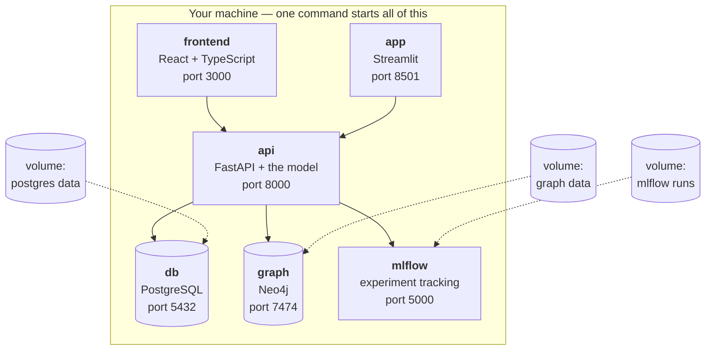

# Containers — running the whole project with one command

**Prerequisites:** [`01-setup.md`](01-setup.md) read at least once. You
do **not** need to have installed Docker or Podman — this document
starts from nothing.

**Learning goal:** after this you will know what a container actually
is (and what it is not), why containers exist, the difference between
Docker and Podman and when each matters, how to install either one on
Windows, macOS or RHEL 8, and how this project is built so the *same
files work with both engines* without changing a line.

**Time:** 40 minutes to read; 20–40 minutes to install, once per
machine.

> Every term is defined in [`GLOSSARY.md`](GLOSSARY.md). Where
> containers appear in the build plan is set out in
> [`ROADMAP.md`](ROADMAP.md).

---

## Contents

- [1. The problem containers solve](#1-the-problem-containers-solve)
- [2. What a container actually is](#2-what-a-container-actually-is)
- [3. The vocabulary, in one table](#3-the-vocabulary-in-one-table)
- [4. Docker or Podman? (and why this project supports both)](#4-docker-or-podman-and-why-this-project-supports-both)
- [5. Installing a container engine](#5-installing-a-container-engine)
- [6. Your first container, in five minutes](#6-your-first-container-in-five-minutes)
- [7. How this project is containerised](#7-how-this-project-is-containerised)
- [8. Writing files that work with both engines](#8-writing-files-that-work-with-both-engines)
- [9. The RHEL 8 traps nobody warns you about](#9-the-rhel-8-traps-nobody-warns-you-about)
- [10. Running the whole system](#10-running-the-whole-system)
- [11. What could go wrong](#11-what-could-go-wrong)
- [12. Committing container work](#12-committing-container-work)

---

## 1. The problem containers solve

### The situation, in ordinary life

You spend a weekend getting a project working on your laptop. It runs
beautifully. You send it to a friend. It does not run. You spend three
evenings finding out why, and the answer is something like: they have a
different version of Python, or a library that needs a system package
they don't have, or their PostgreSQL is version 12 and yours is 16.

This has a name in software: **"it works on my machine."** It is said
with a sigh, because it is the single most common way collaboration
goes wrong.

### Why the virtual environment isn't enough

[`01-setup.md`](01-setup.md) §8 introduced the **virtual environment** —
a sealed toolbox of Python packages for one project. That solves a real
problem, and it solves only part of this one.

A virtual environment seals the *Python packages*. It does not seal:

- the Python interpreter itself
- system libraries the packages depend on
- other programs entirely — PostgreSQL, Neo4j, Node.js
- the operating system underneath all of it

*Analogy.* A virtual environment is your own knife roll — your knives,
nobody else's. Very useful. But you are still cooking in somebody
else's kitchen, on their oven, with their gas supply, at their
altitude. If their oven runs hot, your cake still fails.

### What a container adds

A container seals **the whole kitchen**: the operating system layer,
the interpreter, the system libraries, the packages, your code, and the
instructions for starting it — as one unit that runs identically
anywhere the engine runs.

*Analogy.* Shipping a meal with its own kitchen attached. Same oven,
same gas, same altitude, in any building in the world.

That is the promise, and for this project it is a concrete one: **one
command starts PostgreSQL, Neo4j, the API, the frontend, MLflow and
Airflow, correctly configured and talking to each other, on Windows,
macOS or RHEL 8** — with no manual installation of any of them.

Consider the alternative. Without containers, [`01-setup.md`](01-setup.md)
would need a section on installing and configuring PostgreSQL for three
operating systems, then the same for Neo4j, then Node.js, then Airflow —
each with its own version quirks, service management and troubleshooting.
That document would be a hundred pages and would still not work
reliably. Containers replace all of it with one install, done once.

---

## 2. What a container actually is

### The comparison people usually reach for

You may have heard of a **virtual machine (VM)** — a whole simulated
computer running inside your real one. Your work Linux VM is exactly
that. VMs work, and they are heavy: each carries a complete operating
system, takes gigabytes, and takes minutes to start.

A container is lighter. It shares the host machine's **kernel** — the
core of the operating system that talks to the hardware — and packages
only what sits above it.

*Analogy.* A virtual machine is a separate house: its own foundations,
plumbing, and electricity. A container is a flat in a shared building:
its own front door, its own furniture, its own locks — but the
building's foundations and water supply are shared. Cheaper to build,
faster to move into, and the neighbours still can't walk in.

| | Virtual machine | Container |
|---|---|---|
| Contains | A whole operating system | Just your application and its dependencies |
| Size | Gigabytes | Tens to hundreds of megabytes |
| Start time | Minutes | Seconds |
| Isolation | Very strong | Strong |
| Analogy | A separate house | A flat in a shared building |

### What a container is *not*

- **Not a virtual machine.** It shares the host kernel.
- **Not a security boundary you should bet everything on.** Strong
  isolation, not absolute. Do not run untrusted code in one and assume
  you are safe.
- **Not permanent.** A container is disposable by design. Anything
  written inside it disappears when it is removed — which is why
  §3 introduces **volumes**, the deliberate exception.

That last point surprises people, so say it plainly: **containers are
meant to be thrown away.** You do not repair a container; you delete it
and start a fresh one from the same image. *Analogy:* paper cups, not
china. The value is that every cup is identical.

---

## 3. The vocabulary, in one table

Six words carry almost everything. Learn these and the rest follows.

| Term | What it is | Everyday analogy |
|---|---|---|
| **Image** | A read-only template: a filesystem plus instructions for starting | A cake recipe, plus all the ingredients pre-measured in a sealed box |
| **Container** | A running instance of an image | The cake you actually baked from that box |
| **Dockerfile** / **Containerfile** | The text file describing how to build an image | The written recipe itself |
| **Registry** | A website storing images so others can download them | A public cookbook library. Docker Hub and quay.io are the big ones |
| **Volume** | Storage that survives when a container is deleted | The fridge — it stays when you throw the paper plates away |
| **Compose** | A file describing several containers that run together as one system | The menu for a whole dinner service, saying which dishes and in what order |

Two more you will meet constantly:

**Port mapping** — containers have their own private network. To reach a
program inside one from your browser, you connect an outside door to an
inside door: `-p 8000:8000` means "outside port 8000 leads to inside
port 8000". *Analogy:* the flat has its own doorbell in the shared
lobby.

**Bind mount** — making a folder on your machine visible inside the
container. Used during development so you can edit code and see the
change without rebuilding. *Analogy:* a hatch in the flat's wall
opening onto your own storage room.

---

## 4. Docker or Podman? (and why this project supports both)

### They build and run the same things

Both **Docker** and **Podman** implement the **OCI** standard (Open
Container Initiative) — an agreed specification for what an image is
and how it runs. This matters more than any difference between them:

> **An image built with Docker runs under Podman, and vice versa.**
> They are not competing formats. They are two brands of the same
> appliance.

*Analogy:* petrol from two different filling stations. Different logo,
same fuel, same car.

Podman's commands are also deliberately near-identical to Docker's.
Nearly every `docker` command works as `podman` with no other change.

### Where they genuinely differ

| | Docker | Podman |
|---|---|---|
| Background service | Runs a **daemon** — a program always running in the background as administrator | **Daemonless** — commands run directly, as you |
| Default user | Root (administrator) | **Rootless** — runs as your normal user |
| On RHEL | Removed from RHEL 8 by Red Hat; unsupported | **The default**, shipped and supported |
| On Windows/macOS | Docker Desktop | Podman Desktop, or the command line |
| Licence | Desktop free for personal use and small organisations; larger companies need a paid subscription | Fully open source, no commercial restriction |

**What "daemonless" means and why anyone cares.** Docker keeps a
service running in the background, with administrator rights, that does
the actual work; your `docker` command just sends it instructions.
Podman does the work directly, in your own account.

*Analogy.* Docker is a hotel where you ring the front desk and staff go
and do things for you. Podman is a self-catering flat where you do them
yourself. The hotel is convenient; the flat means nobody with a master
key is standing in the corridor at all times.

**Why rootless matters practically.** On a managed work machine you may
simply not be permitted to run a root daemon. Rootless Podman needs no
special privilege, which is often the difference between "I can use
containers" and "I cannot".

### The decisive fact for this project

**Red Hat removed the Docker engine from RHEL 8.** It is not in the
repositories and is not supported. Podman ships as the default and is
installed from the `container-tools` module.

So for the platform matrix this project targets — Windows, macOS and
RHEL 8 — supporting both engines is not a stylistic choice. On the
Linux VM, Podman is what exists.

### The project's position

**Use whichever engine you already have, or whichever your platform
prefers.** Everything in this repository is written so the same files
work with both:

| Platform | Recommended | Why |
|---|---|---|
| RHEL 8 / Rocky / Alma | **Podman** | The default; Docker is removed and unsupported |
| Fedora | **Podman** | The default |
| Ubuntu / Debian | Either | Docker is conventional; Podman available and fine |
| macOS | Either | Podman Desktop avoids the Docker Desktop licence question |
| Windows | Either | Both use WSL2 underneath |

---

## 5. Installing a container engine

Do **one** of these, once per machine.

> **🐧 RHEL 8 / Rocky / AlmaLinux — Podman**
>
> Podman lives in a **module** — a bundle of related packages that
> Red Hat versions and tests together. This trips people up, because
> the ordinary `dnf install container-tools` fails with "No match for
> argument". You need `dnf module install`:
>
> ```bash
> sudo dnf module install -y container-tools
> ```
>
> Verify:
> ```bash
> podman --version
> ```
> ```
> podman version 4.9.4
> ```
>
> **Optional but genuinely useful** — the compatibility package, which
> makes `docker` an alias for `podman` and creates a Docker-compatible
> socket, so tools expecting Docker work unchanged:
> ```bash
> sudo dnf install -y podman-docker
> ```
> After this, `docker ps` runs `podman ps`. Every command in this
> project's documentation then works verbatim whichever word you type.

> **🐧 Fedora — Podman**
> ```bash
> sudo dnf install -y podman
> ```

> **🐧 Ubuntu / Debian — Podman**
> ```bash
> sudo apt update && sudo apt install -y podman
> ```
> Or Docker, following the official instructions at
> <https://docs.docker.com/engine/install/ubuntu/>.

> **🍎 macOS — Podman**
> 1. Install Podman Desktop from <https://podman-desktop.io/> (or
>    `brew install podman` for the command line only).
> 2. Containers are a Linux technology, so on macOS Podman runs a
>    small hidden Linux virtual machine for them. Create and start it
>    once:
>    ```bash
>    podman machine init
>    podman machine start
>    ```
>    You will not interact with this VM directly, but it is worth
>    knowing it exists, because it explains why file paths and
>    networking occasionally behave in surprising ways.
> 3. Verify:
>    ```bash
>    podman --version
>    podman info
>    ```

> **🍎 macOS — Docker**
> Install Docker Desktop from <https://www.docker.com/products/docker-desktop/>.
> Start it, and wait for the whale icon in the menu bar to stop
> animating. Then:
> ```bash
> docker --version
> ```

> **🪟 Windows — either**
>
> Both engines need **WSL2** (Windows Subsystem for Linux 2) — a real
> Linux kernel running inside Windows. Install it once, in PowerShell
> **as administrator**:
> ```powershell
> wsl --install
> ```
> Restart when prompted.
>
> **Then Podman:** install Podman Desktop from
> <https://podman-desktop.io/>, then in PowerShell:
> ```powershell
> podman machine init
> podman machine start
> podman --version
> ```
>
> **Or Docker:** install Docker Desktop from
> <https://www.docker.com/products/docker-desktop/>, start it, wait for
> the whale icon to settle, then:
> ```powershell
> docker --version
> ```

> ⚠️ **On Docker Desktop licensing.** Docker Desktop is free for
> personal use, education and small organisations, but larger
> organisations require a paid subscription. The thresholds have
> changed more than once, so check the current terms at
> <https://www.docker.com/pricing/> before installing it on a work
> machine. Podman has no such restriction, which on a corporate laptop
> is often the deciding factor.

---

## 6. Your first container, in five minutes

Before touching this project, run something trivial. Understanding one
small container makes the whole system obvious later.

> Throughout this document, **write `podman` or `docker` — whichever
> you installed.** The commands are otherwise identical. If you
> installed `podman-docker` on RHEL, either word works.

### Step 1 — Run a container

```bash
podman run --rm hello-world
```

**Expected output** (abbreviated):

```
Trying to pull docker.io/library/hello-world:latest...
Getting image source signatures
Copying blob ...
Writing manifest to image destination

Hello from Docker!
This message shows that your installation appears to be working correctly.
```

**What just happened, step by step:**

1. You asked for an image called `hello-world`, which you did not have.
2. The engine downloaded it from a **registry** (Docker Hub).
3. It started a **container** from that image.
4. The container printed a message and exited.
5. `--rm` deleted the container automatically.

*Analogy:* you ordered a sealed meal kit you'd never bought before. The
shop delivered it, you cooked it, ate it, and threw the packaging away —
all in one command.

### Step 2 — Run something that stays running

```bash
podman run --rm -d -p 8080:80 --name my-web docker.io/library/nginx
```

Decoded, one flag at a time:

| Part | Meaning |
|---|---|
| `run` | Start a new container |
| `--rm` | Delete it when it stops |
| `-d` | **Detached** — run in the background, give me my prompt back |
| `-p 8080:80` | Port mapping: my port 8080 → the container's port 80 |
| `--name my-web` | Give it a name so I can refer to it |
| `docker.io/library/nginx` | The image: a web server |

Now open <http://localhost:8080> in a browser. You are looking at a web
server you never installed, configured, or will have to uninstall.

**Look at it, then stop it:**

```bash
podman ps          # list running containers
podman logs my-web # what has it printed?
podman stop my-web # stop it (and --rm deletes it)
```

Nothing is left behind. Nothing was installed on your machine. **That
is the entire point of containers**, and you have now seen it work.

### Step 3 — Six commands worth memorising

```bash
podman ps                 # what is running right now
podman ps -a              # everything, including stopped
podman images             # what images do I have on disk
podman logs <name>        # what has this container printed
podman stop <name>        # stop it politely
podman rm <name>          # delete a stopped container
```

`podman ps` is to containers what `git status` is to Git: free,
harmless, and the answer to most "what is going on?" moments. Run it
constantly.

---

## 7. How this project is containerised

Once the platform phases are built, RealSignal runs as **six
containers** that start together as one system.



**Why several containers rather than one big one?** The rule is **one
job per container**. The database container does the database and
nothing else; the API container serves the API and nothing else.

*Analogy:* a restaurant where the kitchen, the bar and the cold store
are separate rooms with doors between them. If the bar floods you do
not lose the kitchen, and you can refit the bar without closing the
restaurant.

Practically, that means you can restart the API after a code change
without restarting the database, and replace PostgreSQL 16 with 17 by
changing one line.

**Why the dotted volumes matter.** Containers are disposable — delete
one and everything inside it is gone. A database that lost its data
every restart would be useless. **Volumes** are storage that lives
outside the container and survives it.

*Analogy:* the paper cups are thrown away after every service; the
fridge stays.

**What is deliberately *not* containerised.** The analysis scripts you
run while learning — `fetch_data.py`, the notebooks, the modelling —
stay as ordinary Python in your virtual environment. Containers are for
*running the system*, not for doing your daily work inside. Editing
code inside a container is slower and more confusing than editing it
normally, and the point of the early phases is that you see and
understand every step.

---

## 8. Writing files that work with both engines

This is the practical heart of the chapter: **how do we support two
engines without maintaining two sets of files?**

Four decisions, each small.

### Decision 1 — Name the recipe `Dockerfile`

Podman prefers the name `Containerfile`; Docker only recognises
`Dockerfile`. But **Podman reads `Dockerfile` perfectly happily**, and
Red Hat's own documentation confirms the instructions available in each
are equivalent.

So: one file, named `Dockerfile`, works with both. No duplication, no
symlinks, no cleverness.

### Decision 2 — Use `compose.yaml`, the standard filename

The **Compose Specification** is an open standard, and its modern
filename is `compose.yaml` (the older `docker-compose.yml` still works).
Both `docker compose` and `podman compose` read it.

### Decision 3 — A tiny wrapper that detects your engine

Rather than making you remember which word to type, a script checks
what you have:

```bash
#!/usr/bin/env bash
# container.sh — run compose with whichever engine is installed.
#
# WHY THIS EXISTS: this project supports both Docker and Podman. Rather
# than documenting two sets of commands and letting them drift apart,
# we detect the engine once, here, and everything else calls this.
#
# Override the choice if you have both and want a specific one:
#     RS_ENGINE=podman ./container.sh up

set -e

# Respect an explicit choice first; otherwise prefer whatever is present.
# Podman is checked first because on RHEL it is the supported engine.
if [ -n "$RS_ENGINE" ]; then
    ENGINE="$RS_ENGINE"
elif command -v podman >/dev/null 2>&1; then
    ENGINE="podman"
elif command -v docker >/dev/null 2>&1; then
    ENGINE="docker"
else
    echo "ERROR: neither podman nor docker found."
    echo "Install one — see docs/CONTAINERS.md section 5."
    exit 1
fi

echo "Using container engine: $ENGINE"
exec "$ENGINE" compose "$@"
```

Then every instruction in the documentation is the same for everyone:

```bash
./container.sh up -d      # start everything
./container.sh ps         # what is running
./container.sh logs -f    # watch the output
./container.sh down       # stop everything
```

*Analogy:* a light switch by the door. It does not matter whether the
building is wired for gas or electricity; you press the switch.

### Decision 4 — Avoid the things that differ

Both engines behave identically if you stay away from a few corners:

- **Use ports above 1024.** Rootless Podman cannot bind low ports
  (80, 443) without extra configuration, because on Unix systems those
  are reserved for administrators. This project uses 3000, 5000, 5432,
  7474, 8000 and 8501 — all comfortably above the line, and chosen for
  exactly this reason.
- **Use named volumes, not host paths, for data.** They behave the same
  everywhere and avoid file-ownership differences between rootless and
  root containers.
- **Always write the full image name.** `docker.io/library/postgres:16`
  rather than `postgres:16`. Docker assumes Docker Hub; Podman may ask
  you to choose a registry. Being explicit removes the difference — and
  is better practice anyway, because it says exactly where your software
  came from.
- **Pin image versions.** `postgres:16`, never `postgres:latest`.
  "Latest" changes underneath you, and a system that silently upgraded
  its database overnight is not reproducible. Same reasoning as pinning
  Python packages in [`01-setup.md`](01-setup.md) §9.

---

## 9. The RHEL 8 traps nobody warns you about

Three things cost people an evening each. They are all easy once known.

### Trap 1 — SELinux and volume mounts

RHEL has **SELinux**, a security system that labels every file and
enforces which programs may touch which labels. It is a genuinely good
thing and it will block your container from reading a mounted folder,
with a `Permission denied` that looks nothing like a permissions
problem you can fix with `chmod`.

*Analogy:* a building where every room has a colour-coded pass, and the
pass matters more than having the key.

**The fix** is a `:Z` suffix on bind mounts, which tells the engine to
relabel that folder for container access:

```yaml
volumes:
  - ./data:/app/data:Z
```

Lower-case `:z` shares the label between several containers; upper-case
`:Z` gives it exclusively to one. Use `:Z` unless two containers need
the same folder.

This is harmless on macOS and Windows, which ignore it. So the project
writes `:Z` everywhere and stays portable.

### Trap 2 — Containers stopping when you log out

Rootless Podman containers belong to *your user session*. By default,
when you disconnect from an SSH session, they can be shut down with it —
which is baffling if you expected a server to keep running.

**The fix**, once per user:

```bash
sudo loginctl enable-linger $USER
```

"Linger" means: keep this user's services running after they log out.

### Trap 3 — `podman compose` not found

Compose support is a separate piece. On older Podman versions install
it:

```bash
sudo dnf install -y podman-compose
```

Newer Podman includes `podman compose` as a subcommand that delegates
to whichever compose implementation is available. If `podman compose`
fails, try `podman-compose` (with a hyphen) — the wrapper script in §8
can be pointed at either.

---

## 10. Running the whole system

Once the platform phases exist, this is the entire startup procedure on
any of the three operating systems:

```bash
git clone https://github.com/akannan2987/realsignal.git
cd realsignal
./container.sh up -d
```

> **🪟 Windows:** `.\container.ps1 up -d`

**Expected output:**

```
Using container engine: podman
[+] Running 6/6
 ✔ Container realsignal-db-1        Started
 ✔ Container realsignal-graph-1     Started
 ✔ Container realsignal-mlflow-1    Started
 ✔ Container realsignal-api-1       Started
 ✔ Container realsignal-app-1       Started
 ✔ Container realsignal-frontend-1  Started
```

Then open:

| Address | What you get |
|---|---|
| <http://localhost:3000> | The React application |
| <http://localhost:8501> | The Streamlit tool |
| <http://localhost:8000/docs> | The API's interactive documentation |
| <http://localhost:5000> | MLflow experiment tracking |
| <http://localhost:7474> | The Neo4j graph browser |

**To stop:**

```bash
./container.sh down          # stop, keep the data
./container.sh down -v       # stop and delete the volumes too
```

⚠️ `-v` deletes your databases. It is the right command when you want a
guaranteed-clean start, and the wrong one at every other moment. It is
worth knowing precisely because the difference between the two is
invisible until it isn't.

**Why this matters.** Someone with no Python, no PostgreSQL, no Neo4j
and no Node.js installed can run three commands and have the entire
system working. That is the difference between a project people admire
and a project people actually try.

---

## 11. What could go wrong

### "command not found: podman" (or docker)

Not installed, or not on your PATH. See §5. On Windows and macOS,
reopen the terminal after installing — PATH changes do not reach
already-open windows.

### "Cannot connect to the Docker daemon"

Docker Desktop is not running. Start it and wait for the whale icon to
stop animating.

### Podman on macOS/Windows: "cannot connect to Podman machine"

The hidden Linux VM is not started:

```bash
podman machine start
```

If it was never created: `podman machine init` first.

### "Permission denied" reading a mounted folder on RHEL

SELinux. Add `:Z` to the volume line — §9, Trap 1.

### "port is already allocated"

Something else is using that port — often a previous run that did not
stop. Find and stop it:

```bash
podman ps                    # is an old container still up?
./container.sh down          # stop this project's containers
```

If it is a different program entirely, change the outside port in
`compose.yaml`: `"8001:8000"` puts it on 8001 instead.

### "no such image" or a registry prompt

Write the fully-qualified name: `docker.io/library/postgres:16` rather
than `postgres:16`. See §8, Decision 4.

### The build is very slow the first time

Expected. It downloads base images — hundreds of megabytes. Later
builds reuse **cached layers** and take seconds. *Analogy:* the first
shop of the week is long; afterwards you only buy what ran out.

### Disk filling up

Images and stopped containers accumulate. Clean up:

```bash
podman system df       # what is using space
podman system prune    # remove stopped containers and unused data
```

Add `-a` to also delete images not currently in use. Safe — anything
removed can be rebuilt or re-downloaded.

### Rootless containers stop when you log out of the RHEL VM

`sudo loginctl enable-linger $USER` — §9, Trap 2.

---

## 12. Committing container work

The same ritual as every phase.

```bash
# 1. Make sure you are on the working branch.
git switch develop

# 2. Check what will be committed.
git status

# 3. Stage everything.
git add -A

# 4. Commit, explaining what and why.
git commit -m "feat: containerise the full stack for Docker and Podman

Adds Dockerfiles for the API, Streamlit app and frontend, a
compose.yaml describing all six services with named volumes, and
engine-detecting wrapper scripts for macOS/Linux and Windows.
Portable by design: fully-qualified image names, pinned versions,
ports above 1024 for rootless Podman, and :Z volume labels for
SELinux on RHEL."

# 5. Push develop, and update beta and master to match.
git push origin develop develop:beta develop:master

# 6. Bring local master in line with the master you just pushed.
git switch master
git pull --ff-only origin master

# 7. Return to the working branch.
git switch develop
```

> **A note on `--tags`.** Only add it when you have actually created a
> tag — at a release, not at every phase:
> ```bash
> git tag -a v1.3.0 -m "Containerised release"
> git push origin develop develop:beta develop:master --tags
> ```

⚠️ **Before committing, check `.gitignore` covers container leftovers.**
Add these lines if they are not already there:

```gitignore
# Container artefacts
.env
*.env.local
```

Never commit a `.env` file containing database passwords. History is
permanent: a secret committed once should be treated as compromised and
rotated, not quietly deleted.

Every command above is explained word by word in
[`GIT_WORKFLOW.md`](GIT_WORKFLOW.md).

---

## What you learned

- Why "it works on my machine" happens, and what a virtual environment
  does and does not fix
- What a container is, how it differs from a virtual machine, and why
  it is meant to be disposable
- Images, containers, registries, volumes, port mappings and compose
- How Docker and Podman differ — daemon versus daemonless, root versus
  rootless — and why RHEL 8 makes the choice for you
- How to install either engine on any of the three platforms
- Four concrete decisions that keep one set of files working with both
- The three RHEL 8 traps: SELinux labels, lingering, and compose

---

**Previous:** [`01-setup.md`](01-setup.md) ·
**Plan:** [`ROADMAP.md`](ROADMAP.md) ·
**Architecture:** [`00-architecture.md`](00-architecture.md) ·
**Terms:** [`GLOSSARY.md`](GLOSSARY.md)
